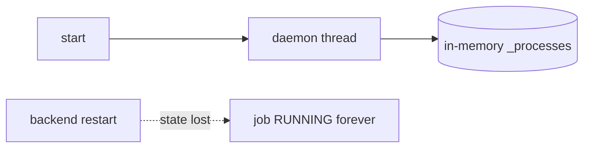
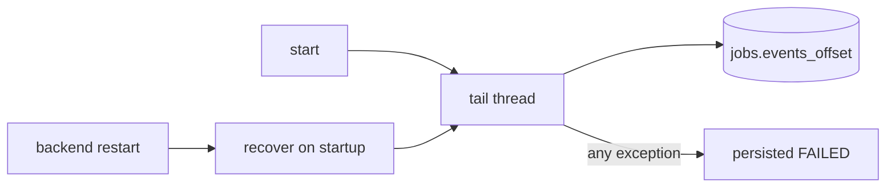
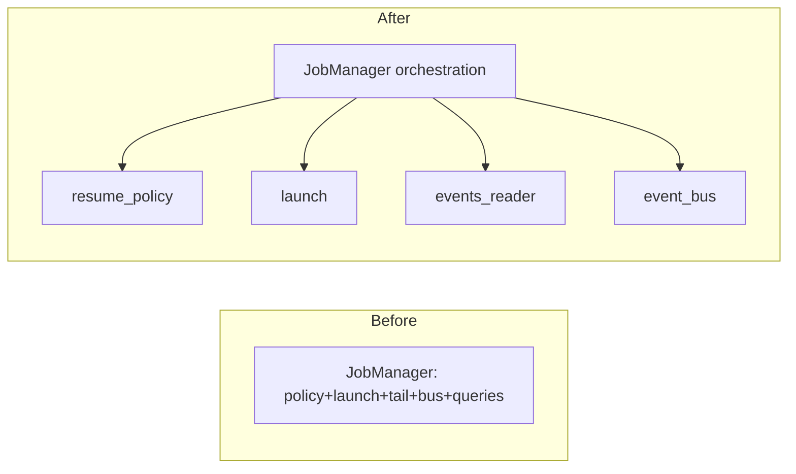
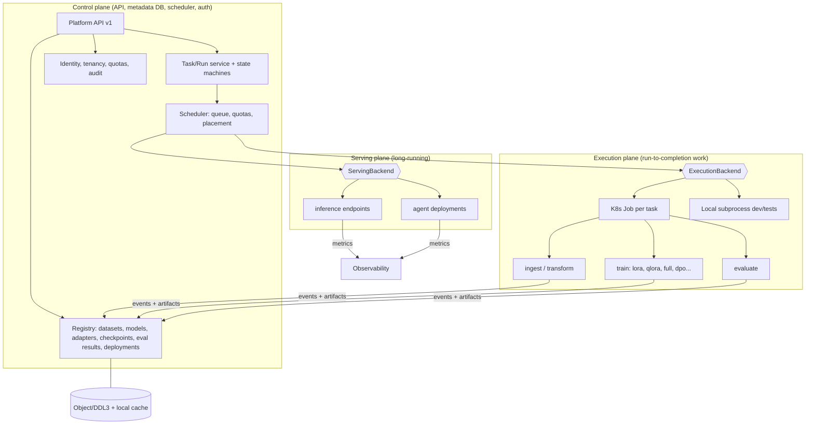
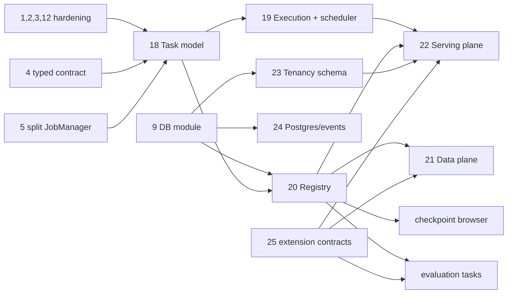

# Architecture Review — ai-accelerator-platform

Independent second review. Reviewer stance: approving (or not) the repository for the next development phase.

**Scope of this review (updated).** The platform is an *enterprise AI accelerator*: many users, many concurrent fine-tuning jobs, and a roadmap of dataset onboarding from many sources, a dataset transformation pipeline, other fine-tuning methods, a checkpoint browser, an evaluation pipeline, an inference pipeline and agent deployment. The review is graded against that product, not the current LoRA demo. Parts A–B cover the existing system's defects (Changes 1–17). **Part B2 covers fitness for enterprise scale and the roadmap (Changes 18–25, ADR list)** and changes the overall verdict.

Labels: **FACT** (observed in code), **INFERENCE**, **RECOMMENDATION**. Line numbers are approximate anchors.

Companion documents: `architecture.md` (current state), `architecture-simplified.md` (onboarding).

---

## Part A — Independent review findings

This review deliberately does not restate the risk table in `architecture.md §18`. It asks structural questions and records only what the directory layout does not reveal.

| # | Question | Verdict | Note (evidence) |
|---|---|---|---|
| 1 | Is the component decomposition correct? | **Mostly** | Three tiers + two shared packages is the right cut. The weak joint is the *backend↔worker seam*: it is a CLI flag list (§Change 4). |
| 2 | Responsibilities in the right places? | **No, in 3 places** | (a) resource-id→path resolution is in the browser (`CreateJob.jsx`); (b) trainer's launch policy (`run_id`, resume flags, DDL flags) is in the backend `_build_flags`; (c) model downloads run in the API process (`models.py`). |
| 3 | Abstractions at the right boundary? | **Mixed** | `TrainingClient` is excellent. `StorageShard` is good. `LocalResourceStorage` is a thin pass-through that DDL had to bypass (`push_staged_to_ddl`) — the abstraction is not real. |
| 4 | Too tightly coupled? | **Hidden coupling exists** | Worker emits stage names that must equal `backend.state_machine.JobStatus` values, yet the worker never imports it (string literals at ~25 `emit` call sites). Coupling by convention. |
| 5 | Too fragmented? | **Slightly** | Four SQLite stores with duplicated connection/lock/schema code; three overlapping "architecture" docs. Conversely `train_lora_with_gpu_stats.py` is under-fragmented. |
| 6 | Circular dependencies? | **None found** | Import graph checked for `backend/*`, `pipeline/checkpoint/*`, `service`. Acyclic. (Not exhaustive for `train_lora*.py`.) |
| 7 | Clean interfaces? | **No at 2 seams** | `GET /jobs` etc. are clean. The flag list and the free-form event dict are not typed, versioned, or validated. |
| 8 | Leaky abstractions? | **Yes** | `api/main.py` reaches into `manager.store.list()/get()`. `activity.py` calls `JobManager.get_checkpoints` per job (file scans). `pipeline/checkpoint/manager.py` imports `BlobStoreBackend` (a simulator) at module top, and the worker CLI's `--checkpoint-storage` defaults to that simulator. |
| 9 | Business logic mixed with infrastructure? | **Yes** | `JobManager` mixes policy (resume rules), process supervision, file tailing, pub/sub, path knowledge, and zipping paths. `DatasetStore` mixes HF import, JSONL validation, storage choice, DDL push, and legacy seeding. |
| 10 | Orchestration mixed with execution? | **No (good)** | Backend orchestrates; the worker executes; service is a process launcher. Exception: the backend executes downloads. |
| 11 | State in the correct layer? | **Partly** | Process liveness lives in two in-memory dicts (backend `_processes`, service `_ProcessRegistry`) — the *only* non-durable state, and exactly the state that matters during failure. |
| 12 | Storage concerns leaking into business logic? | **Yes** | `storage_backend` strings are branched on in `JobManager._build_flags`, `DatasetStore._finalize_storage`, `ModelStore._download`, `CreateJob.jsx`, `build_checkpoint_manager`, `abs_path()`. |
| 13 | APIs stable and well-defined? | **REST yes; internal no** | REST has response models. `POST /datasets/import`, `POST /models`, `PUT /settings` take `Dict[str,str]` or ad hoc models. Service API accepts `flags: List[str]`. |
| 14 | Concurrency boundaries correct? | **No** | Check-then-act on `start()`; SSE on the shared threadpool; resumed jobs share a checkpoint run; one shared SQLite file across four connections. |
| 15 | Error-handling responsibilities clear? | **No** | Launch errors are mapped to FAILED; flag-build/event-parse errors are not. Each failure path lives in a different layer with different persistence (some are persisted in `events.jsonl`, the launch failure is not). |
| 16 | Configuration responsibilities clear? | **No** | Three layers with overlapping names: Settings (`*_storage_backend`), `JobConfig.storage.backend` / `*.source`, per-record `storage_backend`. `checkpoint_storage_backend` in Settings has no server-side effect (UI default only). Env frozen at import. |
| 17 | Scalable? | **Not beyond 1 backend, 1 GPU node** | SQLite single writer on hostPath; no scheduler (`QUEUED` is transient, no capacity logic); service has no concurrency limit. |
| 18 | Testable? | **Backend/checkpoint yes; seam & ops no** | No tests for the service, recovery, concurrency, or the trainer; the stub trainer duplicates the contract by hand. |
| 19 | Observable? | **No** | No metrics/tracing; backend lacks `/healthz`; `train.log` blank in HTTP mode. |
| 20 | Easy for another engineer to extend? | **Backend yes; worker no** | Adding a trainer option touches `config.py` → `_build_flags` → `parse_args` → the 1,100-line worker → (maybe) UI + stub. Adding a storage backend touches ≥6 files. |

### Problems not obvious from the directory structure

1. **The "durable" channel hides a non-durable control plane.** The events file is durable, so the design *looks* crash-safe. But the party that reads it (a daemon thread) and the party that knows whether the worker lives (an in-memory dict) are both volatile. A backend restart orphans every active job while the trainer runs on happily.
2. **`QUEUED` is a lie.** It is set immediately before a thread spawn. Nothing queues. On a one-GPU node, two started jobs run concurrently or OOM each other.
3. **The worker is coupled to the backend's state machine by string.** Changing `JobStatus` silently breaks the worker's events. The coupling flows *backend → worker* even though dependencies are meant to flow the other way (worker knows nothing).
4. **Jobs are not linked to resources.** A job stores a *path string*. Deleting a dataset/model, or moving `DATA_ROOT`, silently breaks jobs, resume and the UI's "follow the source job" logic (`selectResumeJob` reverse-looks-up by path).
5. **`resume` turns a job into a writer of another job's directory.** The checkpoint namespace is a *job id*, so lifecycle (delete) of one job and write access of another are entangled.
6. **Verification-before-commit exists for checkpoints but nothing equivalent exists for events.** Event consumption skips malformed lines and advances the offset (cannot re-read), while the checkpoint subsystem is meticulously safe. The weakest durability is on the control path.
7. **The same fact is stored 3–4 times**: job config (`config.json` + `jobs.config_json`), status (`jobs.status`, `last_event_json`, the events file), checkpoint listing (`events.jsonl` events *and* `catalog.json`). No rule says which wins on conflict.

---

## Part B — Proposed changes

### Change 1 — Make job supervision crash-safe and restart-safe

**Problem.** Job supervision runs in daemon threads and in-memory dicts. A backend restart abandons `QUEUED/RUNNING` jobs forever. Several exceptions kill the supervising thread silently, leaving the job stuck.

**Evidence.**
- `JobManager.start()` spawns `threading.Thread(target=self._run_job, daemon=True)`; `_processes` is a plain dict (`job_manager.py` ~L242, ~L324).
- No startup reconcile anywhere (`grep recover|reconcile|startup` → none).
- `_run_job`: `_build_flags()` raising `ValueError` (e.g. DDL without server) is outside the `try` that maps launch errors; job stays `QUEUED`.
- `_handle_event` → `advance()` → `JobStatus(stage)` raises `ValueError` for unknown stage; only `IllegalTransitionError` is caught.
- `_drain_new_events` skips undecodable lines and still advances `pos`.
- `delete()` refuses active jobs, so a stuck job cannot even be removed.

**Why It Matters.**
- *Reliability:* every deploy of the backend orphans active jobs (the k8s manifest uses `Recreate` and the images are bumped often).
- *Developer velocity/operability:* stuck rows require manual SQL.
- *Testability:* currently untested.

**Proposed Change.**
1. Wrap `_run_job` in a top-level `try/except Exception` that maps any failure to a persisted `FAILED` (same path as the launch failure; also append the event to `events.jsonl`).
2. Catch `ValueError` for unknown stages (log, drop, keep tailing).
3. Persist the tail offset (`jobs.events_offset`) and the remote handle identity so a tail can resume.
4. Add `JobManager.recover()` called from app startup: for each `QUEUED/RUNNING/CHECKPOINTING/EVALUATING` row, build a handle (`_RemoteTrainingHandle` is reconstructible from `job_id` alone; for subprocess mode, mark `FAILED("backend restarted")`), then re-enter `_tail_events` from the saved offset.
5. Do not advance the offset past an incomplete trailing line (only consume lines that end with `\n`).

**Before**

**After**

**Migration Strategy.** Pure addition. Step 1–2 and 5 are independent bug fixes, ship first. Step 3 is `ensure_column` (already in `db_migrate.py`). Step 4 is guarded by a feature flag until tests (kill backend mid-job using the stub trainer) pass.

**Risk:** Low. **Effort:** Small–Medium. **Priority:** P0.

---

### Change 2 — Atomic state transitions and single-flight launch

**Problem.** Status changes are read-then-write; the training service will launch any number of processes for the same or different jobs.

**Evidence.**
- `JobManager.start()`: `store.get` → check `SUBMITTED` → `store.update_status` (separate lock acquisitions; handlers run in a threadpool).
- `_ProcessRegistry.start()` overwrites an existing entry for the same `job_id` without checking whether it is still running (`service/app.py` ~L40).
- No concurrency limit on the GPU node; `QUEUED` is cosmetic.
- `JobStore.update_status` has no `WHERE status = ?` guard.

**Why It Matters.** *Reliability:* double-click on Start (or two tabs) can launch two trainers writing the same `events.jsonl` and checkpoint dir; the registry then tracks only the second, and the first runs unsupervised. *Scalability:* any capacity control is impossible without a real queue boundary.

**Proposed Change.**
- `JobStore.transition(job_id, expected, new, **fields) -> bool` using `UPDATE … WHERE job_id=? AND status=?`; `start()` and `_handle_event` use it; loser gets `IllegalTransitionError`.
- Service: reject (409) a start for a `job_id` whose process is still alive; add an optional `max_concurrent` (default 1 on GPU nodes) returning 429/409 when full. `JobManager` maps that to staying `QUEUED` with a retry (this finally gives `QUEUED` meaning).

**Before** `start: get → check → update` (racy). **After** `start: UPDATE … WHERE status='SUBMITTED'` (atomic) → service guards by id and capacity.

**Migration Strategy.** Add `transition()` next to `update_status()`; switch call sites one at a time; existing tests remain valid. Service guard is backwards compatible (new 409/429 only in conflict cases). Capacity default can start "unlimited" and be tightened per environment.

**Risk:** Low. **Effort:** Small. **Priority:** P0.

---

### Change 3 — Put a trust boundary on the control plane

**Problem.** Both HTTP APIs are open; the training service executes the trainer with caller-supplied arguments on a `hostNetwork` GPU node.

**Evidence.**
- `pipeline/service/app.py`: `StartJobRequest.flags: List[str]` forwarded verbatim into `Popen([... "-m", module, *flags])`.
- `backend/api/main.py`: "No auth in Phase 1"; CORS `*` default.
- `deploy/k8s/nebula-pipeline.yaml`: `hostNetwork: true`, `runAsUser: 0`; `PUT /settings` repoints the DDL endpoint for all subsequent jobs.
- `JobConfig.model.name/dataset.name` are arbitrary strings → paths read on the GPU node.

**Why It Matters.** *Reliability/security:* anyone with network reach can consume the GPU, write to arbitrary paths via `--output-dir`/`--events-file`, or redirect checkpoints. This is the single item that blocks any exposure beyond a trusted lab.

**Proposed Change (smallest useful step).**
1. Shared-secret bearer token (`NEBULA_SERVICE_TOKEN`) required by training-service; sent by `HttpTrainingClient`. Same optional token (or a pluggable dependency) on the backend, wired through nginx.
2. Service validates flags against an allow-list of known flag names and constrains path-valued flags to be under `NEBULA_RUNS_ROOT`/`NEBULA_DATA_ROOT`. (Superseded by the typed contract in Change 4; until then this closes the arbitrary-argument hole.)
3. Backend validates `model/dataset.name` of `source=local` resolve under `DATA_ROOT` (or the legacy dataset path) — ties into Change 6.
4. Default `NEBULA_CORS_ORIGINS` to empty when `NEBULA_TRAINING_BACKEND=http` (prod signal).

**Migration Strategy.** Token disabled when env unset (dev unchanged); enable in k8s via Secret. Allow-list generated from the current `_build_flags` output and covered by a test that fails when they drift.

**Risk:** Low. **Effort:** Small. **Priority:** P0 (if the system leaves a trusted network; otherwise P1).

---

### Change 4 — Replace the flag list and implicit events with a typed, versioned contract

**Problem.** The real API between backend and worker is ~50 untyped CLI flags and an unvalidated event dictionary. The worker implicitly depends on the backend's state names.

**Evidence.**
- `JobManager._build_flags()` (~60 lines of string building) ↔ `parse_args()` (~170 lines) with differing defaults (`--gradient-accumulation-steps` 8 vs `TrainingConfig` 1).
- `nebula_events` has an emitter but no event definitions; ~25 `emitter.emit("RUNNING", "…")` literals in the worker; `stub_trainer.py` re-implements the vocabulary by hand; `web/src/utils.js` (`LIFECYCLE_EVENT_NAMES`) and `JobDetail.jsx` consume the same names a third time.
- `state_machine.JobStatus` values double as worker "stage" strings.

**Why It Matters.** *Maintainability/velocity:* every option change touches 4–5 places; drift is silent. *Testability:* the stub is a hand-copy that can pass while the real worker fails. *Stability:* a rename in `JobStatus` breaks the worker without any failing test.

**Proposed Change.** Grow `shared/nebula-events` (or add `shared/nebula-contract`) with:
- `TrainSpec` (pydantic, version field): everything the worker needs, with resolved resource locations — replaces flags. The service accepts `TrainSpec` JSON and builds argv itself (also closes Change 3 step 2 properly). The worker adds `--spec spec.json` and keeps the old flags during the transition.
- Event type constants + a small `Event` model (`stage`, `event`, typed payload for the ~6 events the backend/UI actually consumes: `checkpoint_saved`, `step`, `epoch_*`, `eval_complete`, `job_complete`, `job_failed`).
- Worker emits `phase` names defined in the contract; backend maps phase→`JobStatus`.

**Before** `JobConfig → _build_flags → argv → argparse`. **After** `JobConfig → TrainSpec → service → worker`, both ends importing one schema.

**Migration Strategy.** (1) Add models + contract tests that run the *real* argparse and the stub against the models. (2) Worker accepts `--spec` in addition to flags. (3) Service accepts either form. (4) Backend switches to spec; flags path kept one release. (5) Delete `_build_flags`. Events: first add validation in *log-only* mode on the backend.

**Risk:** Medium. **Effort:** Medium. **Priority:** P1.

---

### Change 5 — Split `JobManager` along its natural seams (no behavior change)

**Problem.** One 612-line class owns launch policy, resume policy, supervision, event I/O, pub/sub, checkpoint queries, artifact path logic and delete rules.

**Evidence.** `job_manager.py`: `_validate_resume` (~60 lines of policy), `_build_flags`, `_run_job`, `_tail_events`, `_handle_event`, `get_checkpoints`, `get_final_adapter_dir`, `subscribe/unsubscribe/_publish/event_backlog`, `delete`. `api/main.py` also bypasses it via `manager.store.get/list`. `activity.py` depends on `JobManager` just for `get_checkpoints`.

**Why It Matters.** *Maintainability:* any lifecycle change touches this file; merge-conflict hotspot. *Testability:* policy (resume rules) can only be tested by constructing a whole manager. *Developer velocity:* Change 1/2/4 all land here.

**Proposed Change.** Extract, in this order, as plain modules/classes in `backend/` (no new framework):
1. `resume_policy.py` — `validate_resume(config, store, events)` (pure, easily unit-tested).
2. `event_bus.py` — subscribe/unsubscribe/publish (+ bounded queues).
3. `events_reader.py` — read/offset-tail/`checkpoints_from_events` (shared by manager, API, activity).
4. `launch.py` — `TrainingClient` family + flag/spec builder.
5. `JobManager` retains orchestration and the state projection. API gets `get_job/list_jobs` methods; `manager.store` becomes private.

**Before/After**

**Migration Strategy.** Move code verbatim, re-export names from `job_manager.py` so tests and `activity.py` keep importing; one extraction per PR; existing 25+ job-manager/resume tests are the safety net.

**Risk:** Low. **Effort:** Medium. **Priority:** P1.

---

### Change 6 — Make jobs reference resources, and resolve them on the server

**Problem.** The browser decides what a model/dataset *is* (path vs DDL id) and bakes a path string into the job. The server cannot tell a registered resource from an arbitrary path, and jobs have no referential integrity.

**Evidence.**
- `CreateJob.jsx` submit: `model: { name: ddl ? model.id : model.path, source }`; `selectResumeJob` reverse-maps with `(m.storage_backend === "ddl" ? m.id : m.path) === cfg.model.name`.
- `JobConfig.model.name` is a free string (`config.py`); `JobStore` stores `model`/`dataset` as that string.
- `DatasetStore.delete/ModelStore.delete` do not check job references; `abs_path()` is only used by `preview`.
- Three overlapping storage vocabularies (Settings vs `JobConfig.storage` vs `*.source` vs record `storage_backend`); `checkpoint_storage_backend` setting is only a UI default.
- `catalog.py` `MODELS`/`DATASETS` unused by the SPA.

**Why It Matters.** *Reliability:* silent breakage when resources move or are deleted. *Security:* path strings reach the GPU node (Change 3). *Maintainability:* resolution logic is in JS, untestable with the backend suite, and duplicated for the resume path.

**Proposed Change.** Additive fields on `JobConfig`: `model.resource_id`, `dataset.resource_id` (optional). When present, the backend resolves path/source from `ModelStore/DatasetStore` at submit time, stores both the id and the resolved value, and rejects non-ready resources. Legacy `name/source` stays accepted (flagged as "unmanaged") so existing clients and tests keep working. Block deleting a resource referenced by a non-terminal job (and warn for terminal). Delete or repurpose `catalog.py` model/dataset lists. Document one vocabulary: *where is it stored* (`storage_backend`) vs *where does the job read it* (derived).

**Migration Strategy.** (1) Backend resolves when `resource_id` is present. (2) SPA sends ids (and no longer computes paths). (3) Later, deprecate raw names for non-admin callers. Add `jobs.model_id/dataset_id` via `ensure_column`.

**Risk:** Low–Medium. **Effort:** Medium. **Priority:** P1.

---

### Change 7 — Bound the cost of events (backlog, listing, SSE threads)

**Problem.** The events file is read in full on many paths, and each SSE client occupies a worker thread.

**Evidence.**
- `event_backlog` → `read_events` loads whole file per SSE connect; every training `step` event is replayed to each client (`api/main.py:_event_stream`).
- `get_checkpoints` re-scans the file; `/activity` calls it for up to 10 jobs per request (`activity.py`); `_validate_resume` calls it too.
- `_event_stream` is a sync generator blocking in `queue.get(timeout=15)`.
- `read_events` has no try/except; a malformed line breaks the SSE backlog (while the tailer tolerates it).
- Subscriber queues are unbounded; `_subscribers[job_id]` keys are never removed.

**Why It Matters.** *Performance/scalability:* long jobs produce large files; dashboard polling and a few open tabs degrade the whole API, including unrelated endpoints (threadpool starvation).

**Proposed Change.**
- Persist a `checkpoints` projection (table keyed by `job_id, checkpoint_id`) written by the tailer on `checkpoint_saved`; serve `/checkpoints`, activity and resume validation from it. Keep the events file as the source of truth (rebuildable).
- SSE backlog: send a compact snapshot (last `step`, all lifecycle events, all `checkpoint_saved`, losses downsampled) plus `Last-Event-ID`/offset resume; make `read_events` tolerant.
- Make the stream async (`asyncio.Queue` via `loop.call_soon_threadsafe` from the tail thread), bound queue size (drop-oldest for `step`).

**Migration Strategy.** Projection is additive and backfilled lazily from existing files on first access. SSE change is internal; UI already de-duplicates by key. Add a load test (N SSE clients + dashboard polling) to the e2e suite.

**Risk:** Medium. **Effort:** Medium. **Priority:** P1.

---

### Change 8 — Isolate resumed jobs' checkpoint writes

**Problem.** A resumed job reads *and writes* its source job's checkpoint run.

**Evidence.** `_build_flags`: `run_id = resume.job_id if resume else job_id`; local checkpoints dir is `checkpoints_dir(run_id)`. `JobManager.delete` checks only the deleted job's own state. `_validate_resume` requires the source to be terminal *at submit time only*.

**Why It Matters.** *Reliability:* two resumes from one source write the same `catalog.json`; deleting the source destroys a running resume's data; the source job's checkpoint list silently changes after the fact.

**Proposed Change.** Separate *read-from* and *write-to* runs: `--resume-run <source>` (read) and `--run-id <this job>` (write). The checkpoint manager needs `load_checkpoint` from another run's namespace (the DDL backend already namespaces by `run_id`; local backend takes a dir). Interim guard (small): reject a resume whose source has any non-terminal dependent, and reject deleting a job referenced as a source by another job.

**Migration Strategy.** Interim guard first (backend only, no trainer change). Then trainer support for a distinct read run; old behavior stays selectable until verified on both backends with the existing resume tests (`test_resume.py`, `test_resume_state*.py`).

**Risk:** Medium. **Effort:** Medium. **Priority:** P1.

---

### Change 9 — One database module, correct placement of SQLite, sweepers for stale rows

> Enterprise addendum: this module is the seam for **Postgres** (Change 24) and row-level tenancy (Change 23); design it for both from the start.

**Problem.** Four stores duplicate connection/lock/schema/migration code and open four connections to one file on a shared mount; stale transient rows are never cleaned.

**Evidence.** Identical `__init__` in `job_store.py`, `settings_store.py`, `datasets.py`, `models.py`; `RESOURCE_DB_PATH = DATA_ROOT / "nebula.db"` where `DATA_ROOT` is the shared mount; `strategy: Recreate` comment "the backend's SQLite db lives on the shared hostPath"; `ensure_column` is add-only; `models` rows can stay `downloading` forever after a restart.

**Why It Matters.** *Reliability:* SQLite on network filesystems has weak locking; WAL is not enabled; no migration versioning. *Maintainability:* schema changes need edits in four places.

**Proposed Change.** `backend/db.py` with one `Database` (single connection factory, `PRAGMA journal_mode=WAL`, `busy_timeout`, `schema_version` table with ordered migrations replacing `ensure_column`). Stores receive it. Move the DB path to its own setting (`NEBULA_DB_PATH`, default unchanged) so prod can put it on a local PVC while `runs/` and `data/` stay shared. On startup, mark `downloading/pending` models `error("interrupted by restart")` (same hook as Change 1's `recover()`).

**Migration Strategy.** Behavior-preserving refactor first (same file, same schema); then WAL; then optional path split. `SettingsStore(":memory:")`-style test seams are preserved by `Database(":memory:")`.

**Risk:** Low. **Effort:** Small–Medium. **Priority:** P1.

---

### Change 10 — Stop defaulting to the simulator and remove the dead trainer copy

**Problem.** An omitted flag can run a "checkpointed" job whose data evaporates at exit; an unused 559-line trainer copy confuses edits.

**Evidence.**
- `parse_args`: `--checkpoint-storage` `default="blobstore"`, `choices=[blobstore, local, ddl]`; `build_checkpoint_manager`: `else: storage = BlobStoreBackend()`. The backend always passes `local`/`ddl`, so the exposure is direct CLI use and the manager's own default.
- `blobstore_backend.py` docstring: shards are in-process simulations that do not persist.
- `pipeline/train_lora.py` is referenced by no code (grep); differs from the active script by ~668 diff lines; docstring examples in both still say `python -m pipeline.train_lora`.

**Why It Matters.** *Reliability:* silent data loss path. *Maintainability:* fixes applied to one trainer and not the other.

**Proposed Change.** Make `--checkpoint-storage` required (no default); rename the simulator choice so it is explicit (`blobstore-sim`) and keep it for tests/benchmark only; stop defaulting to it in `manager.py`. Delete `train_lora.py` (history preserves it) or move it under `pipeline/legacy/` with a README note; fix docstrings.

**Migration Strategy.** Search for callers (none found), run `pytest`, ship. Benchmark script updated in the same PR.

**Risk:** Low. **Effort:** Small. **Priority:** P1 (quick win).

---

### Change 11 — Make failure diagnostics and operability first-class

**Problem.** In the production topology the backend cannot see why a trainer died, and there is no health/metrics surface on the backend.

**Evidence.**
- `_run_job` opens `train.log` and passes it to `training_client.start`; `HttpTrainingClient.start` ignores it and `_ProcessRegistry.start` calls `subprocess.Popen(argv)` with inherited stdio. `_log_tail()` is empty in HTTP mode, so synthesized errors say only "worker exited with code N".
- `_build_flags` never passes `--log-file` although the worker supports it.
- Backend has no `/healthz`; k8s probes `GET /config` (static data, proves nothing about SQLite or the shared mount).
- No counters/timers anywhere; `CheckpointMetrics` only appears as event payloads.

**Why It Matters.** *Operability:* the most common failure (OOM kill) is exactly the one with the least information. *Reliability:* readiness probe can pass while storage is unwritable.

**Proposed Change.** Service redirects trainer stdout/stderr to `<runs>/<job>/train.log` (path derived from the validated spec/`runs` root) or `_build_flags` adds `--log-file`; backend adds `/healthz` (SQLite `SELECT 1`, `RUNS_ROOT` writable) and `/readyz`; add minimal Prometheus-style counters (jobs by state, event lag, SSE clients) behind one module; structured log lines carry `job_id`.

**Migration Strategy.** Log redirect is additive. Health endpoints are new routes; update k8s probes after. Metrics are optional dependency-free (text exposition).

**Risk:** Low. **Effort:** Small. **Priority:** P1.

---

### Change 12 — Add the missing test layers and CI

**Problem.** The riskiest seams have no automated tests; there is no CI config in the repository.

**Evidence.** No import of `pipeline.service.app` in any test (only a fake of it in `test_remote_training_handle.py`); no test for restart/recovery, double start, SSE fan-out; web has only lint; `.github/` absent; `train_lora_with_gpu_stats.py` untested (acknowledged in CLAUDE.md); `test_e2e_real_training.py` docstring points at `app/tests/…`.

**Why It Matters.** *Developer velocity/safety:* Changes 1, 2, 4, 7 are only safe with these tests. *Testability:* the contract has a hand-written stub as its only executable specification.

**Proposed Change.** (a) `pipeline/tests/test_service_app.py` using `TestClient` and a fake `Popen`; (b) contract tests (argparse ↔ spec/flags; every `emit` stage ∈ allowed phases — can be done via AST scan today); (c) concurrency tests (double start; N SSE clients); (d) recovery test with the stub trainer; (e) one CI workflow: `pytest` (no GPU), `npm run lint && build`, compose-file validation.

**Migration Strategy.** Land tests first, mark known-failing cases `xfail` with the Change number, flip as fixes land.

**Risk:** Low. **Effort:** Medium. **Priority:** P0 for (a)(d)+CI skeleton; remainder P1. (Listed P1 overall; pull (a)(d) forward with Changes 1–2.)

---

### Change 13 — Break up the worker module and keep the entrypoint thin

**Problem.** `train_lora_with_gpu_stats.py` (1,123 lines) holds CLI parsing, logging, DDL materialization, data loading, model construction, GPU stats, the training loop, eval, resume and checkpoint wiring. It is the one large component with no tests.

**Evidence.** Function list: `parse_args`, `materialize_ddl_resource`, `load_training_dataset`, `split_train_eval`, `run_evaluation`, `build_model_and_tokenizer`, `build_checkpoint_manager`, `save_training_checkpoint`, `resume_training_state`, `PhaseTimer`, `main`, `_run_training` (~400 lines).

**Why It Matters.** *Testability/velocity:* the only way to test any of it is torch+GPU. Pure parts (arg → config, dataset split, event emission order, resume decisions) are untestable in isolation.

**Proposed Change.** Mechanical extraction into `pipeline/worker/`: `cli.py`, `resources.py` (materialize), `data.py`, `modeling.py`, `checkpointing.py` (the two checkpoint functions + `build_checkpoint_manager`), `loop.py`; leave `train_lora_with_gpu_stats.py` as a ≤100-line entrypoint so the module path in the service/Dockerfile is unchanged. Make torch imports local to the modules that need them so CPU-only tests can import the rest.

**Migration Strategy.** One function-group per PR, no behavior edits; verify with the real e2e (`RUN_REAL_E2E_TEST=1`) and the stub; do after Change 4 so the CLI/spec is only reshaped once.

**Risk:** Medium (untested code). **Effort:** Medium–Large. **Priority:** P2.

---

### Change 14 — Move model download and dataset import off the API request path

> For datasets this is subsumed by **Change 21** (ingest as a task); for models it becomes an `ingest` task kind under **Change 18**.

**Problem.** Multi-GB downloads and HF dataset imports run in the API process (thread or request thread).

**Evidence.** `ModelStore.create_download` → daemon thread → `snapshot_download`; `DatasetStore.create_from_huggingface` runs `load_dataset` inline in a sync handler; k8s manifest comment: "1Gi was OOM-killed mid-download of a 3 GB model, surfacing as a 502"; backend limit raised to 4Gi to accommodate.

**Why It Matters.** *Reliability:* a download can OOM or restart the process that also serves every other request and supervises every job. *Scalability:* the backend memory sizing is dictated by its worst background task.

**Proposed Change.** Run ingestion through the same launch seam as training (a "task" run by the pipeline image or a dedicated short-lived process), with the same events/state projection; backend keeps metadata only. Do this *after* Changes 1, 4, 5 so tasks reuse the supervision/contract machinery rather than creating a second one.

**Migration Strategy.** Introduce a `TaskClient` beside `TrainingClient`; migrate `ModelStore` first (largest pain), keep the in-process path behind a flag for local dev.

**Risk:** Medium. **Effort:** Large. **Priority:** P2.

---

### Change 15 — One truthful description of deployment and docs

**Problem.** README, CLAUDE.md, `docs/pipeline-architecture.md`, `pipeline/README.md` and the manifests disagree in places; the deployed topology differs from the documented one.

**Evidence.** See `architecture.md §18` discrepancy list: README k8s sketch (RWX PVC, separate nodes) vs `deploy/k8s` (`hostPath`, same-node `nodeSelector`, `hostNetwork`); env tables omit `NEBULA_DDL_*`, `UCX_*`; README install line omits `nebula-ddl-storage`; stale `app/`/`training/` paths in docstrings; compose image tags (`0.1.0`) vs manifests (`0.2.x`).

**Why It Matters.** *Velocity:* new engineers follow the README and build the wrong mental model; the "shared-storage across nodes" claim is untested in the actual deployment (it would also expose Change 9's SQLite-on-NFS issue).

**Proposed Change.** Designate: `README.md` = how to run; `architecture.md` = current architecture (this review); `pipeline/README.md` = checkpoint internals; fold or retire the STE document into the simplified one. Add a "Deployments" section stating what is tested (single node, hostPath) vs intended (multi-node RWX). Add a docs check to CI (grep for `app/`/`training/` stale paths).

**Migration Strategy.** Docs-only, can run in parallel with everything.

**Risk:** Low. **Effort:** Small. **Priority:** P2.

---

### Change 16 — Introduce a real scheduler seam (expanded and re-prioritised by Change 19)

> Superseded in scope by **Change 19** (execution backend + scheduler). Kept for the cancel/queue details.

**Problem.** `QUEUED` has no queue; there is no capacity model, placement, or cancel.

**Evidence.** `start()` immediately spawns; service has no limit; no cancel route/`TrainingClient.cancel`.

**Why It Matters.** Required for a GPU fleet, but not before.

**Proposed Change.** After Changes 1, 2, 4: add `TrainingClient.cancel(job_id)` (service `DELETE /jobs/{id}` → SIGTERM then SIGKILL; backend `POST /jobs/{id}/cancel`, new state `CANCELLED` or `FAILED(cancelled)`), then a minimal DB-backed queue (`QUEUED` rows picked by a dispatcher thread honoring per-node capacity). Under the enterprise scope, Kubernetes Jobs are the intended production backend (Change 19); still avoid an external broker (Redis/SQS) until measurements require one.

**Migration Strategy.** Cancel is additive. Dispatcher replaces the immediate spawn behind a flag; default still immediate until capacity is configured.

**Risk:** Medium. **Effort:** Medium–Large. **Priority:** P2 (cancel itself: P1 if users ask for it).

---

### Change 17 — Remove import-time side effects

**Problem.** Importing `backend.api.main` creates the app, opens SQLite and may create directories; paths are frozen from env at import.

**Evidence.** `app = create_app()` at module bottom; `workspace.RUNS_ROOT/DATA_ROOT` computed at import; tests `monkeypatch.setattr(workspace, "RUNS_ROOT", …)`; `JobManager` calls `default_training_client()` at construction and raises on bad env at import time of the app.

**Why It Matters.** *Testability/velocity:* import order bugs; config cannot change without restart; surprising failures when merely importing the module.

**Proposed Change.** `uvicorn backend.api.main:create_app --factory`; a `Settings` object (env read once, passed in) replaces module globals gradually; keep `workspace` functions but have them take a root.

**Migration Strategy.** Keep `app = create_app()` available until Dockerfile/compose/k8s use the factory. Do last.

**Risk:** Low. **Effort:** Small–Medium. **Priority:** P3.

---

## Part B2 — Enterprise scale and product-roadmap fitness

**Added scope (stated by the product owner).** The platform will be used by many people in an enterprise, running many fine-tuning jobs concurrently. The roadmap adds: dataset onboarding from many sources, a dataset transformation pipeline, other fine-tuning methods, a checkpoint browser, an evaluation pipeline, an inference pipeline, and agent deployment. Decisions taken now become the foundation for all of these, so this part evaluates the current design against that product, not against the current LoRA demo.

**Headline finding (INFERENCE from the code below).** The current system is a well-built *single-purpose* pipeline: "one LoRA training run = one job = one subprocess". Every roadmap feature is a *different kind of work* (ingest, transform, train, evaluate, serve, deploy an agent) with its own lifecycle, resources and outputs. The current abstractions have no place for them: the job model, the state machine, the event contract, the storage model and the UI all assume the training run is the only unit of work.

### B2.1 Does running training as a subprocess hurt performance at scale?

**Verdict: no. The subprocess is not the bottleneck; the missing platform around it is.** (No benchmark was run; this is from the code.)

- Process spawn costs milliseconds to seconds; fine-tunes run minutes to hours and are GPU-bound. Training throughput is the same in a subprocess, a pod or a thread.
- Process-per-run is the *correct* unit for scale: it gives crash containment, memory release (the repo documents glibc/CUDA memory ratcheting in `docker-compose.yml`), and it is what distributed training (`torchrun`) and Kubernetes Jobs require anyway.
- What will fail first under many concurrent jobs:

| Bottleneck | Evidence | Effect at enterprise scale |
|---|---|---|
| No scheduler / capacity model / GPU assignment | `JobManager.start()` spawns immediately; `QUEUED` is transient; `_ProcessRegistry` has no limit; nothing sets `CUDA_VISIBLE_DEVICES` | N started jobs share one GPU and OOM each other; no fairness |
| Single training-service, in-memory registry, `hostNetwork`, single-node pin | `service/app.py`; `deploy/k8s/nebula-pipeline.yaml` | Cannot add GPU nodes; restart forgets all runs |
| Cold start per job | Worker loads the model each run; DDL path copies into `<output-dir>/_ddl_staging/` (`materialize_ddl_resource`) | Minutes of idle GPU per job; repeated multi-GB copies |
| Per-job polling and per-viewer threads | `_tail_events` reopens `events.jsonl` every 0.2 s per job; sync SSE generators use the shared threadpool | Control-plane CPU and thread exhaustion grow with jobs × viewers |
| Whole-file scans | `get_checkpoints`, `/activity`, `event_backlog` | Cost grows with run length and number of viewers |
| SQLite on a shared hostPath, one replica | `RESOURCE_DB_PATH`, `strategy: Recreate` | No backend scale-out; write contention |
| No tenancy controls | No auth, quotas, ownership fields anywhere | One user can monopolise GPUs; no audit |

### B2.2 Roadmap-fit matrix (what each future feature hits in today's code)

| Roadmap feature | Hard blocker in current design | Evidence |
|---|---|---|
| **Dataset onboarding from many sources** | A dataset is one mutable, uniquely-named `dataset.jsonl`; only `.jsonl` upload and Hugging Face import exist; sources flatten to a single `text` field; no connector concept, no schema, no versions, no ownership | `datasets.py` (`create_local`, `create_from_huggingface`, `_SCHEMA name UNIQUE`); `DatasetConfig.name` is a path |
| **Dataset transformation pipeline** | No notion of a derived dataset, lineage, or a step that is not training. Ingest runs inline in an API request/thread; transformations need compute, retries, progress and outputs — i.e. the same lifecycle as training, which only training can use | `DatasetStore.create_from_huggingface` inline; `ModelStore._download` daemon thread; state machine is training-shaped (`CHECKPOINTING`, `EVALUATING`) |
| **Other fine-tuning methods** | Method is hard-coded: `TrainingConfig.method: Literal["lora"]`; the entrypoint, flags, `lora_*` fields, checkpoint contents (`lora_state_dict`) and UI validation (`"Only LoRA is currently supported"`) all assume LoRA; adding QLoRA/full-FT/DPO means editing config, `_build_flags`, a 1,100-line script, and the SPA | `config.py`, `_build_flags`, `train_lora_with_gpu_stats.py`, `CreateJob.jsx` |
| **Checkpoint browser** | Checkpoints exist only as events in a per-job file and chunks in a per-job namespace; listing is a file scan; there is no registry, no metadata index, no cross-job query, no retention/GC; inspection is a CLI (`inspect_checkpoint.py`); the SPA `Checkpoints` page is per-job events | `get_checkpoints`; `CheckpointSummary`; `pipeline/checkpoint/inspect_checkpoint.py` |
| **Evaluation pipeline** | Evaluation is an inline phase of a training run (`EvaluationConfig.split_ratio`, `EVALUATING` stage, held-out loss only). It cannot evaluate an existing checkpoint/adapter/model against a benchmark independently, nor compare runs | `config.py`, `run_evaluation` in the worker |
| **Inference pipeline** | No model/adapter registry: the trained adapter is a directory under `runs/<id>/artifacts/final_adapter`, downloadable as an in-memory zip; it is not a registered, versioned asset that can be a base for serving or evaluation. No serving runtime exists | `get_final_adapter_dir`, `download_artifact`; `Deployments.jsx` is a placeholder page |
| **Agent deployment** | Needs a long-running, network-addressable workload with a lifecycle, scaling, auth, secrets, routing and observability — none exists. The execution model is "run to completion and exit"; the state machine has no long-lived `RUNNING` service semantic | `state_machine.py`; no serving code; `Deployments.jsx` |

Cross-cutting gaps that every feature needs and none has: **identity/tenancy** (no `owner`/`tenant` column in any table), **versioned artifacts with lineage**, **a generic async work abstraction**, **a placement/capacity layer**, and **an extension contract** for new methods/connectors/evaluators.

### B2.3 Platform target architecture (proposed north star)

RECOMMENDATION. Keep the good parts (events channel, `TrainingClient`-style seam, pure state machine, checkpoint core) and generalize them into **three planes** with explicit contracts, rather than adding features onto the current job path:

Principles: (1) *Task* is the generic unit of run-to-completion work and *Deployment* the generic unit of long-running work; (2) everything a task consumes or produces is a **versioned registry asset with lineage**; (3) the worker contract is a **typed spec in, typed events + assets out**; (4) execution and serving are **backends behind interfaces**; (5) every row has an **owner/tenant**.

---

### Change 18 — Introduce a generic Task (run) model; training becomes one task type

**Problem.** The job model is the training run. Ingest, transform, evaluate and other methods have nowhere to live, and each would otherwise copy `JobManager`, its state machine, its SSE and its event handling.

**Evidence.** `JobStatus` contains `CHECKPOINTING`/`EVALUATING` (training-specific states) in the one global state machine; `TrainingConfig.method: Literal["lora"]`; `JobConfig` mixes model, dataset, training, storage, checkpoint, evaluation in one schema; `ModelStore._download` and `DatasetStore` re-implement "launch background work and track state" separately.

**Why It Matters.** *Maintainability/velocity:* each roadmap feature would either bolt onto `JobManager` (god class grows) or fork it (N supervisors, N event channels). *Scalability:* a single scheduler and a single observability story are only possible with one run abstraction.

**Proposed Change.**
- Generic `Task` {id, `kind`, `spec` (typed per kind, versioned), `inputs` (asset refs), `outputs` (asset refs), `state`, owner/tenant, resources requested}.
- Generic coarse state machine (`PENDING → QUEUED → RUNNING → SUCCEEDED | FAILED | CANCELLED`) in the platform; *phases* (`checkpointing`, `evaluating`, `materializing`…) become **progress events**, not platform states. This also decouples workers from `JobStatus` (Change 4).
- Per-kind **task handler** registered with: spec model, validator, argv/pod builder, event schema, and output-asset registration. `TrainLoRA` becomes the first handler; `Ingest`, `Transform`, `Evaluate`, `TrainQLoRA`, etc. are added without touching the supervisor.
- `JobManager` (after Change 5) becomes the generic Task supervisor.

**Before** `JobConfig → JobManager → training flags` for one kind. **After** `TaskSpec(kind) → registry of handlers → generic supervisor → ExecutionBackend`.

**Migration Strategy.** Keep `/jobs` and `JobConfig` as a *facade* that creates `kind=train.lora` tasks, so the SPA, tests and stored rows keep working. Add `kind`, `spec_version` columns via migration (Change 9). Map existing `JobStatus` ↔ new states in one adapter; retire the training-specific states from the platform machine only after the UI reads phases from events.

**Risk:** Medium. **Effort:** Large. **Priority:** P0 (design + ADR now; implement before the second task kind is built).

---

### Change 19 — Execution backend and scheduler (replaces/expands Change 16)

**Problem.** There is no placement, capacity, fairness or GPU assignment; the only launcher is "Popen on a service on the one node".

**Evidence.** See B2.1. `TrainingClient` only knows `start`, with `python_executable`/`entrypoint_module` arguments that are meaningful only for a local subprocess.

**Why It Matters.** *Scalability/reliability/performance:* concurrency is the defining enterprise requirement; without a scheduler, throughput collapses under contention and one tenant can starve the rest.

**Proposed Change.**
- `ExecutionBackend` interface: `submit(task) -> RunHandle`, `status`, `cancel`, `logs`, with implementations: `LocalSubprocess` (dev/tests), `KubernetesJob` (production). Replace `python_executable/entrypoint_module` by the task handler's runtime descriptor (image, command, resources).
- DB-backed scheduler (queue ordered by priority/fair-share): per-node/pool GPU capacity, explicit GPU assignment, per-tenant quotas, retry policy for infrastructure failures (distinct from job failure), cancel and preemption hooks. `QUEUED` becomes real.
- Durable run status independent of the launcher: wrapper writes `exit.json`; or the K8s Job status is the source of truth. Remove the in-memory `_ProcessRegistry`.
- Keep RDMA/hostNetwork specifics in the backend's pod template (device plugin resources), not in the platform API.

**Before** `start() → thread → HTTP → Popen`. **After** `submit → queue → scheduler → backend → pod`.

**Migration Strategy.** Land Changes 1–2 first (durable supervision). Introduce `ExecutionBackend` wrapping the existing `TrainingClient` implementations unchanged; add `cancel`; then add the K8s backend behind a feature flag per task kind; leave the training-service for single-node dev until retired. Do not add an external broker until measurements require one.

**Risk:** Medium. **Effort:** Large. **Priority:** P0 for the interface and capacity model; K8s backend P1.

---

### Change 20 — Versioned asset registry with lineage (datasets, models, adapters, checkpoints, eval results)

**Problem.** Assets are rows or directories with no versions, ownership, lineage or lifecycle. Trained outputs are not registered, so they cannot be reused by evaluation, inference or deployment, and a checkpoint browser has nothing to query.

**Evidence.** `datasets.name UNIQUE` and in-place mutable files; `ModelStore` holds only HF snapshots; the adapter is a path under `runs/<id>/artifacts/`; checkpoints are discovered by scanning `events.jsonl` (`get_checkpoints`) even though `catalog.json` exists; jobs reference assets by path string (Change 6); `metadata.json` files are "never parsed back".

**Why It Matters.** *Maintainability:* every feature (browser, eval, serving, agents) needs "what produced this, what can I do with it". *Reliability:* reproducibility and rollback require immutable versions. *Enterprise:* governance, retention and audit are impossible without it.

**Proposed Change.**
- One `assets` model: `(type, name, version, digest, location(s), owner/tenant, metadata(schema per type), parents[] (lineage), created_by_task, state)`. Types: `dataset`, `base_model`, `adapter`, `checkpoint`, `eval_report`, `endpoint`.
- Immutable versions; names are mutable aliases (`latest`, `prod`).
- Tasks declare typed inputs and outputs; the supervisor registers outputs when the task ends (the typed event contract of Change 4 carries output manifests).
- Checkpoint browser reads this registry (replaces events scan; supersedes the projection table in Change 7 for checkpoints); retention/GC policies become possible.
- Storage locations are a property of an asset version (`local`, `ddl`, later object store), resolved server-side (Change 6).

**Before** path strings, per-job event scans. **After** `Task → registers → Asset(version, lineage)`; consumers reference `asset@version`.

**Migration Strategy.** Add tables alongside existing ones; backfill existing datasets/models/completed jobs' adapters and checkpoints as `v1` assets; dual-write for one release; switch reads (browser first), then job inputs; leave the physical layout (`runs/`, `data/`) untouched initially.

**Risk:** Medium. **Effort:** Large. **Priority:** P0 (data model/ADR); incremental implementation P1.

---

### Change 21 — Data plane: connector-based onboarding and a transformation pipeline as tasks

**Problem.** Onboarding is two hard-coded paths in one store, run in the API process, producing a single-JSONL `text` dataset. There is no extension point for new sources or for transformations.

**Evidence.** `DatasetStore.create_local` / `create_from_huggingface`, `_format_example`, `.jsonl`-only check, flattening to `{"text": ...}`; `load_training_dataset` assumes a `text` field; ingest memory held in the API (`await file.read()`).

**Why It Matters.** *Scalability/performance:* enterprise datasets are large and arrive from object stores, databases, warehouses, document stores; in-process ingest cannot stream or parallelise. *Extensibility:* each new source today means editing the store, router, schema and SPA.

**Proposed Change.**
- **Source connector contract** (`discover → schema → read(batches)`), registered like task handlers; built-ins: upload, Hugging Face, then S3/GCS/Azure, SQL, etc. Credentials via a secret store reference (never in request bodies).
- Ingest and each transformation (dedupe, filter, chat-template/format conversion, split, tokenization-cache) are **Tasks** (Change 18) that read a dataset asset and write a new dataset asset version with lineage (Change 20). A pipeline is a small DAG of tasks (start with linear chains; defer a general workflow engine).
- Dataset schema is explicit (columns, format, split) instead of "a `text` field or the first column"; training handlers declare which schema they accept and do formatting from the schema.
- Stream to storage (chunked upload, multipart) rather than buffering in memory.

**Migration Strategy.** Wrap today's two paths as the first two connectors with identical outputs (a `v1` dataset asset); move `load_dataset` import into an ingest task (subsumes Change 14 for datasets). Add schema detection as metadata first, enforcement later.

**Risk:** Medium. **Effort:** Large. **Priority:** P1 (contracts decided with Changes 18/20; implementation before the first new connector).

---

### Change 22 — Serving plane for inference and agents (separate from the run-to-completion path)

**Problem.** The roadmap's inference and agent features are long-running services, which the "run to completion and exit" job path cannot represent, and which have different scale, security and observability needs.

**Evidence.** `Deployments.jsx` is a placeholder; the state machine terminates in `COMPLETED/FAILED`; no serving code, routing, autoscaling or auth exists; the adapter is only downloadable as a zip.

**Why It Matters.** *Reliability/performance:* serving needs warm models, batching, autoscaling, health, SLOs and multi-tenant isolation; building it as "a job that never ends" would inherit all of the training path's shortcomings. *Security:* agents execute tools and call external systems; they need sandboxing, secrets and egress control.

**Proposed Change.**
- `Deployment` resource {asset ref (base model + adapter), runtime, resources, replicas/autoscale, auth policy, endpoint URL, state}, reconciled by a controller against a `ServingBackend` interface (K8s Deployment/KServe/vLLM as an implementation detail chosen later; do not choose the engine now).
- Inference endpoints first (OpenAI-compatible API in front of the engine is the usual enterprise expectation — RECOMMENDATION, to be validated with users); agent deployments are a second `kind` on the same plane, adding tool/secret/egress policy and traces.
- Gateway in front of all endpoints for authN, rate limits, quotas, usage metering and audit.
- Evaluation of a deployed or candidate model reuses Evaluate tasks (Change 18) against the registry (Change 20).

**Migration Strategy.** Design the `Deployment` resource and registry references now (no code); implement after Changes 18–20 and 23. Do not retrofit training-service for this.

**Risk:** Medium–High (new runtime). **Effort:** Large. **Priority:** P1 for the resource model/ADR; implementation later.

---

### Change 23 — Identity, tenancy, authorization, quotas and audit as a platform foundation

**Problem.** There is no identity anywhere, and adding it after data and APIs exist is the most expensive retrofit in the system.

**Evidence.** No `owner`, `tenant` or `created_by` column in `jobs`, `datasets`, `models`, `settings`; global singleton `settings` row (one DDL endpoint and storage choice for everyone); no auth middleware; DDL `tenant` exists only as a storage isolation integer.

**Why It Matters.** *Security/compliance:* enterprise adoption requires SSO/OIDC, RBAC, project/tenant isolation, audit logs, secret handling. *Reliability:* quotas and fairness (Change 19) require an identity to attribute usage to.

**Proposed Change.**
- Add `tenant_id`/`owner` to every table and asset now (nullable → backfilled to a default tenant), with row-level filtering in one data-access layer (Change 9).
- OIDC authentication at the gateway/API; RBAC roles (viewer, developer, admin) and project scoping; service-to-service auth for the execution plane (Change 3).
- Per-tenant settings (storage endpoints, defaults) replace the global singleton; secrets referenced, not stored in rows.
- Audit log of control-plane mutations; usage metering (GPU-seconds per task/deployment).

**Migration Strategy.** Schema first (columns + default tenant, no behavior change); enforce filtering behind a flag; then enable OIDC; then quotas. Existing single-tenant deployments keep working with the default tenant.

**Risk:** Medium. **Effort:** Large. **Priority:** P0 for schema/ADR (cheap now, costly later); enforcement P1.

---

### Change 24 — Scale the control plane: database, events and data locality

**Problem.** The control plane's storage and event mechanics are sized for a demo (see B2.1 table).

**Evidence.** Four SQLite connections on a shared hostPath; per-job 0.2 s file polling; whole-file scans; SSE on the shared threadpool; per-job full model materialization.

**Why It Matters.** *Performance/scalability/reliability:* the enterprise load profile (hundreds of tasks, thousands of viewers, multi-GB assets) breaks each of these independently.

**Proposed Change.**
- **Metadata DB:** keep SQLite for dev/test; run Postgres in production behind the single `Database` module (Change 9) so the stores are written once. Needed for multiple backend replicas, row-level tenancy and the registry's relational queries.
- **Events:** keep `events.jsonl` on the shared volume as the worker's append-only record, but have a small number of shared tailers (or the K8s sidecar) ingest into a durable event table/stream with offsets (Change 1/7); SSE served from that with bounded async fan-out; consider a broker (NATS/Redis Streams/Kafka) only when measurements show the DB fan-out saturating.
- **Data locality:** node-local read-only model/dataset cache (content-addressed by asset digest, Change 20) mounted into task pods; DDL3 remains the durable tier. Avoid per-task copies into `_ddl_staging`.
- **Shared volume:** treat RWX/hostPath as an interim; define object store (or DDL3) as the system of record for artifacts, with `runs/` as scratch.
- **Benchmarks as acceptance gates:** record time-to-first-step, GPU idle gap between tasks, control-plane CPU and SSE latency at 1/10/100 concurrent tasks and N viewers.

**Migration Strategy.** Each element is independently switchable: DB URL setting; event ingestion alongside the existing tail; cache as an optional mount. No big-bang cutover.

**Risk:** Medium. **Effort:** Large. **Priority:** P1 (decide now; Postgres and event ingestion are prerequisites for multi-replica).

---

### Change 25 — Extension contracts and API versioning (methods, connectors, evaluators)

**Problem.** Every extension today is a code edit across 4–6 files, and the API is unversioned with ad hoc request shapes.

**Evidence.** Adding a trainer option touches `config.py` → `_build_flags` → `parse_args` → worker → UI; `Dict[str, str]` bodies for `/models`, `/datasets/import`; no `/v1` prefix; `catalog.py` is a hand-maintained static list.

**Why It Matters.** *Developer velocity:* with seven feature areas arriving, each implemented by different people, uncontrolled coupling is the main schedule risk. *Stability:* an enterprise UI/SDK/CI needs a versioned, documented API.

**Proposed Change.**
- A **handler/plugin contract** per extension point (task kind, connector, evaluator, serving runtime): `spec model`, `validate`, `build runtime descriptor`, `event schema`, `output assets`, UI form schema (JSON Schema) so the SPA renders forms from the server instead of hard-coding fields (replaces `catalog.py`).
- `/v1` API with OpenAPI as the contract; pydantic request models for every endpoint; deprecation policy.
- Contract tests that every handler passes (like the one proposed in Change 12(b)).
- Publish the platform's capability catalog (`GET /v1/capabilities`) so the UI shows only what the deployment supports.

**Migration Strategy.** Introduce `/v1` as an alias of current routes; migrate the SPA route by route; build the handler registry with the existing LoRA training as the reference implementation.

**Risk:** Low–Medium. **Effort:** Medium. **Priority:** P1 (contracts defined with Change 18).

---

### B2.4 Decisions to record before building the roadmap (ADR list)

These are expensive to reverse. Each needs a short written ADR with the owner and date before the first dependent feature is built.

| # | Decision | Recommended default | Why now |
|---|---|---|---|
| ADR-1 | Generic Task/Deployment model; phases as events | Task (run-to-completion) + Deployment (long-running) | Every feature's data model hangs from it (Change 18, 22) |
| ADR-2 | Execution backend and scheduler | `ExecutionBackend` interface; K8s Job per task; DB-backed queue; no external broker yet | Determines concurrency, cancel, durability (Change 19) |
| ADR-3 | Registry with immutable versions and lineage | One `assets` model, digest-addressed | Browser, eval, serving, governance all depend on it (Change 20) |
| ADR-4 | Worker contract | Typed spec in; typed events and output manifests out; versioned | Decouples workers from backend; enables new methods (Change 4, 25) |
| ADR-5 | Tenancy and identity | `tenant_id` on every row now; OIDC + RBAC at the API/gateway | Retrofit cost grows with every table (Change 23) |
| ADR-6 | System-of-record storage | Postgres for metadata; DDL3/object store for artifacts; `runs/` is scratch | Multi-replica, scale, durability (Change 24) |
| ADR-7 | Serving plane | Separate plane and resource; engine choice deferred behind `ServingBackend` | Avoids building agents on a batch-job abstraction (Change 22) |
| ADR-8 | Data model for datasets | Typed schema + versions + connector contract | Onboarding and transformation depend on it (Change 21) |

### B2.5 Sequencing (dependency order, not calendar)

Rule of thumb: **do not start the second task kind (transform, evaluate, another fine-tuning method) or the serving plane before Changes 4, 5, 9, 18 and the ADRs above are done**, otherwise each feature will copy the current training path and the copies will have to be reconciled later.

## Part C — Recommended Refactoring Plan

Priorities below are for the **enterprise product scope** (many tenants, many concurrent jobs, the full feature roadmap). Items marked ▲ were raised by Part B2 relative to the first draft of this review.

### P0 — Must Fix Before Next Development Phase

Two groups: **P0-A hardening** of what exists, and **P0-B foundation decisions** that every roadmap feature will inherit.

**P0-A — Hardening**

| Change | Reason | Dependencies | Risk | Complexity | Expected benefit |
|---|---|---|---|---|---|
| **1** Crash/restart-safe supervision | Every backend deploy orphans active jobs; silent thread deaths | None | Low | S–M | Jobs always reach a terminal state; safe redeploys |
| **2** Atomic transitions + single-flight launch | Double-start race; unlimited concurrent trainers | None | Low | S | No duplicate trainers; prerequisite for scheduling |
| **3** Control-plane trust boundary | Open endpoints launch GPU processes with arbitrary args | None | Low | S | Safe beyond a lab network |
| **12 (a)(d) + CI skeleton** | Regression net for 1–3 | With 1–2 | Low | S–M | Fixes stay fixed |

**P0-B — Foundation decisions (ADR-1…ADR-8, §B2.4) and the contracts they imply** ▲

| Change | Reason | Dependencies | Risk | Complexity | Expected benefit |
|---|---|---|---|---|---|
| **4** Typed spec + event contract (design and shared package) ▲ | Worker contract is the interface every new task kind and method will implement | 3, 12(b) | Medium | M | One versioned contract; new methods without editing the supervisor |
| **18** Generic Task model; training = one kind ▲ | Without it each roadmap feature forks `JobManager` | 4, 5 | Medium | L | One supervisor, scheduler, SSE and metrics for all work |
| **19** `ExecutionBackend` interface + capacity model ▲ | Concurrency is the enterprise requirement; no placement/GPU assignment today | 1, 2, 18 | Medium | L (interface M) | Real queue, cancel, K8s later without API change |
| **20** Asset registry data model (versions, lineage) ▲ | Browser, eval, serving, governance all depend on it | 9, 18 | Medium | L (model first) | Reproducibility; reuse of outputs as inputs |
| **23** Tenancy/identity schema (`tenant_id`, owner on every row) ▲ | Cheapest now, most expensive retrofit later | 9 | Medium | M (schema) | Enables RBAC, quotas, audit |
| **5** Split `JobManager` ▲ (was P1) | Prerequisite for 18; every change lands there | 12 tests | Low | M | Policy testable; lower conflict rate |
| **9** Single DB module (Postgres-ready) ▲ (was P1) | Seam for 20, 23, 24 | 1 | Low | S–M | One migration path; swap SQLite→Postgres by config |

### P1 — Strongly Recommended

| Change | Reason | Dependencies | Risk | Complexity | Expected benefit |
|---|---|---|---|---|---|
| **19** K8s Job backend + DB-backed scheduler, fair share, quotas ▲ | Turns the interface into scale | 19 (interface), 23 | Medium | L | Multi-node, many concurrent jobs, cancel, durable status |
| **20** Registry implementation, checkpoint browser on it ▲ | Delivers the browser and removes events scans | 20 (model) | Medium | L | Cross-job checkpoint/asset queries; retention/GC |
| **21** Connector-based onboarding + transformation tasks ▲ | New sources/transforms without editing stores | 18, 20 | Medium | L | Extensible data plane; streaming ingest |
| **22** `Deployment` resource + serving plane design ▲ | Inference/agents are long-running, not jobs | 18, 20, 23 | Med–High | L | Clean serving path; no batch-job abstraction abuse |
| **23** Enforce RBAC/OIDC, quotas, audit ▲ | Enterprise adoption | 23 schema | Medium | L | Governance, attribution, fairness |
| **24** Postgres, event ingestion, node-local model cache, benchmarks ▲ | Control-plane and cold-start scale | 9, 19 | Medium | L | Multi-replica backend; shorter time-to-first-step |
| **25** Extension contracts, `/v1` API, JSON-Schema forms ▲ | Seven feature areas by different teams | 18 | Low–Med | M | Parallel development without cross-edits |
| **6** Jobs reference assets server-side | Integrity, safer paths | 20 | Low–Med | M | Server owns resolution |
| **7** Bound event costs / async SSE | Full scans, threadpool-bound SSE | 5 | Medium | M | Dashboard/SSE scale |
| **8** Isolate resumed jobs' writes | Shared checkpoint namespace races | 12 tests | Medium | M | Safe concurrent resumes/deletes |
| **10** Stop defaulting to simulator; remove dead trainer | Non-persistent default; dead code | None | Low | S | Quick win |
| **11** Diagnostics, health, metrics | `train.log` blank in prod topology | None | Low | S | Actionable failures |
| **12 (rest)** Contract, concurrency, load tests | Protects 4, 5, 7, 19 | — | Low | M | Safe refactoring |

### P2 — Valuable Later

| Change | Reason | Dependencies | Risk | Complexity | Expected benefit |
|---|---|---|---|---|---|
| **13** Split worker module | Largest untested component | 4 | Medium | M–L | CPU-testable pieces |
| **14** Model ingestion off the API path (as a task kind) | OOM/restart coupling | 18 | Medium | M | Backend sized for API work |
| **15** One truthful docs/deploy story | Docs drift | None | Low | S | Faster onboarding |
| **16** Preemption/priorities beyond basic queue | Advanced scheduling | 19 | Medium | M | Better utilisation |

### P3 — Optional

| Change | Reason | Dependencies | Risk | Complexity | Expected benefit |
|---|---|---|---|---|---|
| **17** No import-time side effects | Test/config hygiene | Docker/k8s command updates | Low | S–M | Predictable startup |

---

## Part D — What should NOT be changed yet

- **Do not replace the events-file channel *as the worker's output*.** It remains the best decision in the system (append-only, replayable, decoupled). Change what *reads* it (shared tailers, durable event table, Changes 1, 7, 24); introduce a broker only if measured fan-out saturates the DB.
- **Do not rewrite the checkpoint subsystem.** Its format, commit protocol, sharding and verify-before-commit are the most mature code here. Touch it only for Change 8, Change 10, and registering checkpoints as assets (Change 20).
- **Do not pick the serving engine, the workflow engine, or the agent framework yet.** Define the interfaces (`ServingBackend`, task DAG of linear chains) and the ADRs; choose implementations when the first concrete use case exists.
- **Do not build a general workflow/DAG engine** for transformations before linear task chains prove insufficient.
- **Do not add external infrastructure (Kafka, Redis, a service mesh) pre-emptively.** Add Postgres and Kubernetes Jobs, which have clear, near-term payoffs; others only when benchmarks demand them.
- **Do not replace React/Vite/nginx or the pydantic models.**
- **Do not generalize `StorageShard` further** before Change 10 and the asset-location model of Change 20.
- **Do not start a second task kind, a new fine-tuning method, or any serving code** before Changes 4, 5, 9, 18 and ADR-1…ADR-5 are complete.

---

## Is the Repository Ready for the Next Development Phase?

### Verdict for the enterprise roadmap scope: **NOT READY**

(Verdict for the original, narrower scope — a single-node LoRA demo with more UI features — was **READY WITH REFACTORING**. The change is caused by the stated product scope, not by new defects.)

**Why.**
- **What is good enough to keep:** acyclic dependencies, clean tier boundaries, the `TrainingClient` seam, the pure state machine, the events channel, and a mature checkpoint core with real tests. The repository is a good *training pipeline*.
- **Why it is not a foundation for the product:** the roadmap's features are different kinds of work (ingest, transform, train, evaluate, serve, agents). The system has one unit of work (a LoRA training run), one state machine shaped like it, no versioned assets or lineage, no identity or tenancy, no scheduler or execution abstraction, and no serving model. Building the roadmap on this foundation means each feature copies the training path; reconciling those copies later costs far more than defining the abstractions now.
- **Why not "start over":** none of the required foundations demand a rewrite. Each is an additive layer behind a facade that keeps `/jobs`, the SPA and the tests working (Changes 18–25 Migration Strategy sections).

**Minimum architectural work before feature development continues:**
1. **Hardening (P0-A):** Changes 1, 2, 3 and the test/CI skeleton from Change 12. Roughly 1–2 engineer-weeks.
2. **Written decisions (P0-B):** ADR-1…ADR-8 in §B2.4, reviewed with the people who will build datasets, evaluation, inference and agents. Days, not weeks, but they must involve those teams.
3. **Foundation code (P0-B):** Change 5 (split `JobManager`), Change 9 (database module, Postgres-ready), Change 4 (typed worker contract), Change 18 (Task model behind a `/jobs` facade), the `ExecutionBackend` interface and capacity model of Change 19, the registry schema of Change 20, and the tenancy columns of Change 23. A realistic order is given in §B2.5.
4. **Evidence:** run the concurrency benchmark described in Change 24 (1/10/100 tasks, N viewers) on the GPU node before choosing between scheduler options.

Once items 1–3 are in place the verdict becomes **READY WITH REFACTORING**, and feature work (new connectors, new methods, evaluation, checkpoint browser) can proceed in parallel against the contracts, with serving and agents following the `Deployment` design (Change 22).
