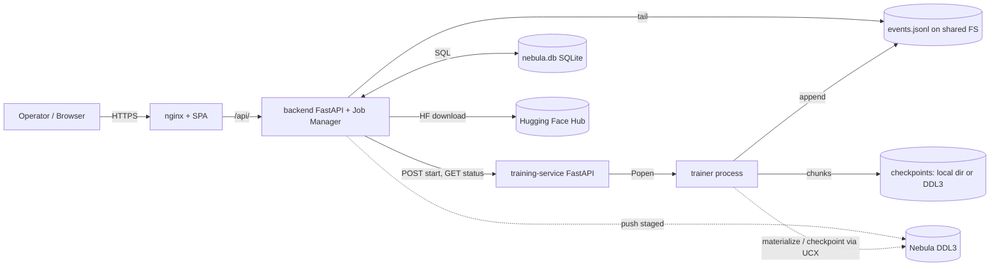
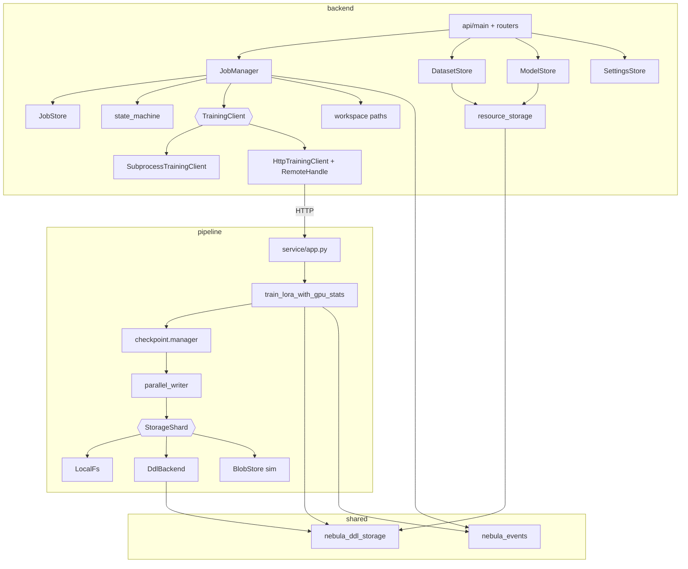
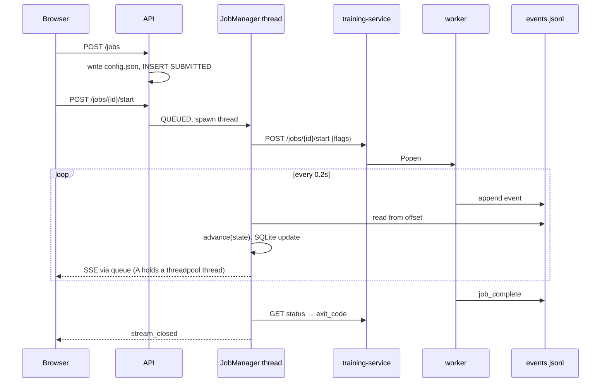
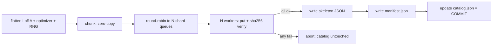

# Architecture — ai-accelerator-platform (current state)

Author role: Principal Architect review. Basis: source code at branch `usr/jaysd21/split-deployment-ddl-ucx` (HEAD `5b9d685` + uncommitted RDMA/k8s edits).

Evidence labels used throughout:

- **FACT** — directly observed in code/config (file reference given).
- **INFERENCE** — strongly implied by the code, not stated.
- **RECOMMENDATION** — architectural opinion (kept to §17–19; the full proposals are in `architecture-review.md`).

Line numbers are approximate anchors for the current tree.

---

## 1. Executive Summary

The system is a LoRA fine-tuning platform: a React SPA (`web/`), a CPU-only FastAPI backend that owns metadata and a "Job Manager" (`backend/`), and a GPU-side training agent (`pipeline/`) that runs a PyTorch/PEFT trainer as a subprocess and checkpoints through a chunked, sharded, parallel writer. Two small zero-ML shared packages (`shared/nebula-events`, `shared/nebula-ddl-storage`) carry the wire contract and the Nebula DDL3 connection code.

The defining architectural choice (FACT) is that **the training process and the Job Manager communicate through exactly one channel: an append-only `events.jsonl` file on shared storage.** The backend triggers a run over HTTP, then *tails the file* and derives job status from it. Everything else (state machine, SSE streaming, checkpoint listing, activity feed, resume validation) is a projection of that file plus one SQLite database.

The design is clean at the package boundary level and well tested at the unit level. Its weaknesses are operational rather than structural: in-memory process state with no recovery, an unauthenticated control plane that can launch processes, a single-writer SQLite on a shared mount, resource-id→path resolution performed in the browser, and the "shared POSIX mount at the same path" assumption baked into the contract.

## 2. System Purpose

**Problem.** Let a user pick a base model and dataset, run a LoRA fine-tune on a GPU node, watch progress live, checkpoint durably (optionally into Nebula DDL3 parallel object storage over RDMA/TCP via UCX), resume from a checkpoint, and download the resulting adapter.

**Users.**
- Human operators via the SPA (Dashboard, Jobs, Datasets, Models, Settings).
- The platform's authors, who use the checkpoint subsystem as a vehicle to benchmark DDL3 storage throughput (FACT: `pipeline/benchmark_checkpoint.py`, per-job selectable checkpoint backend in `CreateJob.jsx` "compare checkpoint throughput" comment).

**Major responsibilities.**
1. Resource management: datasets (upload/HF import), models (HF download), settings (storage backend choice, DDL endpoint).
2. Job lifecycle: submit, start, track, stream, delete, resume, artifact download.
3. Training execution: model/dataset materialization, LoRA training, evaluation, checkpointing.
4. Durable checkpointing with integrity verification.

## 3. Architecture Overview

```
 Browser ──HTTP──> nginx (web) ──/api/──> backend (FastAPI) ──HTTP──> training-service (FastAPI, GPU node)
                                              │                              │ subprocess.Popen
                                              │                              ▼
                                              │                    python -m pipeline.train_lora_with_gpu_stats
                                              │                              │
                       SQLite (nebula.db) ◄───┤                              │ writes
                       tails events.jsonl ◄───┴──── shared storage ◄─────────┘  events.jsonl, checkpoints/, artifacts/
                                                          ▲
                                                          └─ optionally DDL3 (Nebula) via ddl_client/UCX for models, datasets, checkpoints
```

| Component | Role |
|---|---|
| `web/` | SPA; only talks to `backend` via `web/src/api.js`. |
| `backend/api/*` | HTTP translation layer (routers own no logic — FACT per module docstrings). |
| `backend/job_manager.py` | Orchestrator: submit/start/delete, launch via `TrainingClient`, tail events, state transitions, SSE pub/sub, resume validation, checkpoint listing. |
| `backend/{job,settings}_store.py`, `datasets.py`, `models.py` | Four independent SQLite-backed stores sharing one DB file. |
| `backend/state_machine.py` | Pure transition table. |
| `pipeline/service/app.py` | 83-line HTTP wrapper that `Popen`s the trainer and reports its exit code. |
| `pipeline/train_lora_with_gpu_stats.py` | The worker (1,123 lines): arg parsing, DDL materialization, model/dataset load, training loop, eval, checkpoint calls, event emission. |
| `pipeline/checkpoint/*` | Checkpoint library: format, chunker, serializer, state flattening, parallel writer, storage backends, validation. |
| `shared/nebula-events` | `JsonlEventEmitter`, `read_events` — the contract. |
| `shared/nebula-ddl-storage` | `DdlConnection` (owner-thread RPC wrapper over native `ddl_client`), `DdlResourceStore` (directory-level put/get). |

## 4. Repository Structure

| Path | Responsibility |
|---|---|
| `backend/api/main.py` | `create_app()`, job/SSE/artifact routes, CORS, module-level `app = create_app()` (side effect at import: opens SQLite files). |
| `backend/api/{datasets,models,settings}.py`, `schemas.py` | Sub-routers (dependency-injected stores) and response models. |
| `backend/job_manager.py` (612) | See §5.2. Also contains `TrainingClient` Protocol + `Subprocess`/`Http` implementations and `_RemoteTrainingHandle`. |
| `backend/config.py` | `JobConfig` (pydantic) — the job request schema and persisted `config.json`. |
| `backend/workspace.py` | Path layout; `RUNS_ROOT`/`DATA_ROOT` resolved from env **at import time**. |
| `backend/resource_storage.py` | `LocalResourceStorage` (dir per resource id) and `push_staged_to_ddl()`. |
| `backend/catalog.py` | Static model/dataset/storage option lists served at `GET /config`. |
| `backend/activity.py` | Dashboard activity feed derived at request time. |
| `backend/db_migrate.py` | `ensure_column()` — add-column-only migration helper. |
| `pipeline/checkpoint/` | `manager.py` (633), `format.py`, `chunker.py`, `parallel_writer.py`, `storage_backend.py` (ABC), `localfs_backend.py`, `ddl_backend.py`, `blobstore_backend.py`, `validation.py`, `state_flatten.py`, `serializer.py`, `sizing.py`, `tensor_adapter.py`, `tensor_io.py`, `inspect_checkpoint.py`. |
| `pipeline/train_lora.py` (559) | Earlier trainer; **not imported or launched by anything** (FACT: grep) — see §18. |
| `pipeline/utils/{events,metrics,seed}.py` | `events.py` is a re-export shim of `nebula_events`. |
| `deploy/k8s/` | Two Deployments (`nebula-training` hostNetwork+GPU+RDMA; `nebula-web` backend+frontend sidecars), Services, RDMA device-plugin DaemonSet. |
| `docker-compose*.yml` | base + cpu/gpu profile + dev overlay (bind mounts + `--reload`). |
| `docs/pipeline-architecture.md` | Existing 844-line STE-style description (see §18 for drift). |
| `web/src/pages/*` | One page per route; `CreateJob.jsx` (504) is the largest and contains business logic. |
| `data/`, `runs/` | Default `DATA_ROOT` (incl. `nebula.db`, demo dataset) and `RUNS_ROOT`. |

## 5. Component Architecture

### 5.1 `web/` (SPA)

- **Responsibility:** UI; job creation wizard; live job view via `EventSource`.
- **Inputs/Outputs:** user actions → REST calls (`api.js`); SSE events → React state.
- **Dependencies:** react, react-router-dom; Vite; nginx in the container proxies `/api/` → `BACKEND_URL` with buffering off and 1h timeouts (`nginx.conf.template`).
- **Data structures:** events are de-duplicated client-side by key `ts|event|stage` (`JobDetail.jsx`) because the server may double-deliver.
- **Lifecycle:** `JobDetail` fetches `GET /jobs/{id}` once, then relies on SSE; closes the stream on terminal stage/`stream_closed`; `es.onerror` closes permanently (no reconnect).
- **Failure behavior:** errors rendered as banners; **no SSE reconnect** — a dropped connection leaves a stale view until reload.
- **Notable (FACT):** the browser resolves a selected registry resource into the job config — `model: { name: ddl ? model.id : model.path, source }` (`CreateJob.jsx` submit handler). Business mapping lives in the client.

### 5.2 `backend/job_manager.py` — Job Manager

- **Responsibility:** the only owner of job state transitions and the only component that knows how a `JobConfig` becomes CLI flags.
- **Inputs:** `JobConfig`; `events.jsonl`; poll results from a `TrainingHandle`.
- **Outputs:** SQLite rows, `runs/<id>/config.json`, SSE events, synthesized terminal events.
- **Dependencies:** `JobStore`, `SettingsStore`, `state_machine`, `workspace`, `nebula_events`. Never imports `pipeline` (FACT).
- **Key interfaces:**
  - `TrainingClient.start(job_id, flags, log_file, *, python_executable, entrypoint_module) -> TrainingHandle`.
  - `TrainingHandle.poll() -> Optional[int]`.
  - `JobManager.submit/start/delete/get_checkpoints/get_final_adapter_dir/subscribe/event_backlog`.
- **Lifecycle of a job:** `submit()` validates resume, mints a 12-hex id, writes `config.json`, inserts `SUBMITTED`. `start()` → `QUEUED`, spawns a daemon thread running `_run_job`: build flags → `client.start` → `_tail_events` (poll every 0.2 s while `proc.poll() is None`, final drain, reconcile).
- **State held in memory (FACT):** `_processes` (job→handle), `_subscribers` (job→list of unbounded `queue.Queue`), `_pub_lock`.
- **Failure behavior:**
  - launch error (`OSError`/`URLError`) → `FAILED` + `job_failed` published (not written to `events.jsonl`).
  - worker exit without terminal event → synthesized `job_failed` is **appended to `events.jsonl`** and stored, so late SSE joiners terminate (explicit decision, documented in code).
  - remote worker unknown (HTTP 404) for 30 s → exit code −1 (`_RemoteTrainingHandle`).
  - illegal stage transition → logged and dropped (`_handle_event`).
  - Not handled: see §12.

### 5.3 `backend/state_machine.py`

Pure table: `SUBMITTED→QUEUED→RUNNING⇄{CHECKPOINTING,EVALUATING}→COMPLETED`, `FAILED` from any non-terminal. `advance(current, stage)` turns a worker `stage` string into a status; equal stage is a no-op. `JobStatus(stage)` raises `ValueError` for an unknown stage string (not `IllegalTransitionError`).

### 5.4 Stores (`job_store.py`, `settings_store.py`, `datasets.py`, `models.py`)

- Each opens **its own** `sqlite3.connect(nebula.db, check_same_thread=False)` guarded by its own `threading.Lock`; identical boilerplate ×4.
- `JobStore`: one `jobs` table, `config_json` blob, `last_event_json`. `duration_s` computed on read.
- `SettingsStore`: singleton row (`id=1`) with three per-domain storage backends + DDL endpoint (server/port/tenant/cpu_base).
- `DatasetStore`: also seeds a legacy demo dataset at construction; ingest = stage locally → optionally `push_staged_to_ddl` and delete local copy.
- `ModelStore`: `create_download` returns `pending`; a daemon thread runs `huggingface_hub.snapshot_download` **inside the API process**; status `pending→downloading→ready|error`.
- **Failure behavior:** download failure → row `error`, staging dir deleted. A process restart mid-download leaves the row `downloading` forever (no sweeper).

### 5.5 `backend/api/*`

Thin translators. Exception→HTTP mapping is done per route (404/409/422/400). `create_app()` accepts injected managers/stores (the testing seam). `download_artifact` zips the adapter directory in memory.

### 5.6 `pipeline/service/app.py` (training-service)

- **Responsibility:** remote `Popen` + status.
- **Interface:** `POST /jobs/{id}/start {flags: [str]}` → 202; `GET /jobs/{id}/status → {exit_code}`; `GET /healthz`.
- **State:** `_ProcessRegistry`: `dict[job_id → Popen]` + lock. In memory only.
- **Facts:** the service spawns `python -m pipeline.train_lora_with_gpu_stats *flags` with **inherited stdout/stderr** (no `log_file`), accepts **arbitrary flag lists** from the caller, has **no auth**, no cancel/stop endpoint, never evicts finished entries, and silently replaces a registry entry if the same `job_id` is started twice.

### 5.7 `pipeline/train_lora_with_gpu_stats.py` — worker

- **Responsibility:** the whole training run in one 1,100-line module: argparse (~170 lines), logging setup, DDL materialization to `<output-dir>/_ddl_staging/`, tokenization, train/eval split, training loop with `PhaseTimer`, GPU stats, checkpoint save/resume, event emission.
- **Inputs:** CLI flags (the real API between backend and worker); local or DDL model/dataset.
- **Outputs:** `events.jsonl` lines; checkpoints; `artifacts/final_adapter/`.
- **Failure behavior:** top-level `except Exception` emits `job_failed` then re-raises; hard kills emit nothing (backend synthesizes).
- **Event vocabulary (FACT):** stages `RUNNING/CHECKPOINTING/EVALUATING/COMPLETED/FAILED`; events include `worker_started, model_materializing_start, …, epoch_start, step, checkpoint_saved, eval_start, eval_complete, job_complete, job_failed`. The vocabulary is defined only by the emit call sites, not by a schema (the `nebula_events` package contains the emitter but no event definitions).

### 5.8 `pipeline/checkpoint/`

- **Format:** `manifest.json` + independently addressable chunk blobs + `catalog.json`; checksums per chunk; optional pack of small tensors.
- **Write path:** `manager.save_checkpoint` plans chunk jobs → `ParallelWriter` (N bounded per-shard queues, N worker threads, each owning one `StorageShard`) → verify (re-read & sha256, on the same pool) → skeleton JSON → `manifest.json` → catalog update (commit point).
- **Backends:** `LocalFsBackend`, `DdlBackend` (8-byte length framing, key = hash(namespace+blob_id) → 128-bit id, per-shard `DdlConnection` with owner thread), `BlobStoreBackend` (in-process simulation; README "Known limitations": not persistent).
- **Failure behavior:** a failed chunk write aborts the checkpoint before the catalog is touched; a crash between manifest and catalog leaves an orphan readable only with `allow_incomplete=True`.
- **Default hazard (FACT):** the worker's `--checkpoint-storage` accepts `blobstore|local|ddl` and **defaults to `blobstore`** (`parse_args`); `build_checkpoint_manager` uses the in-process `BlobStoreBackend()` simulation for it, which loses data at process exit. The backend always passes `local` or `ddl`, so only direct CLI runs and the `BlobStoreCheckpointManager` constructor default hit it.

### 5.9 `shared/nebula-ddl-storage`

`DdlConnection` pins all native calls to one owner thread via a queue (required because UCX worker asserts thread ownership and aborts the process otherwise). `DdlResourceStore` stores whole directories as chunked objects for models/datasets. Native import is lazy/guarded.

## 6. Runtime Architecture

### 6.1 Job creation → completion (HTTP trigger mode)

```
Browser              backend (API+JobManager)             training-service          worker                   shared FS
  │ POST /jobs ───────────> validate resume, mint id ───────────────────────────────────────────────────────> runs/<id>/config.json
  │                          SQLite INSERT SUBMITTED
  │ POST /jobs/{id}/start ─> SUBMITTED→QUEUED, thread ──POST /jobs/{id}/start {flags}──> Popen ───────────>
  │ GET  /jobs/{id}/events   _tail_events: poll 0.2s                                                       appends events.jsonl
  │ <──── SSE backlog + live <─ read file, advance(), SQLite update, fan out to queues <────────────────────┘
  │                          poll GET /jobs/{id}/status ───────────> proc.poll()
  │                          worker exit → final drain → (synthesize FAILED if no terminal event) → stream_closed
```

### 6.2 Model/dataset ingest

`POST /models` → row `pending` → daemon thread → `snapshot_download` into `DATA_ROOT/models/<id>` → (optional) `push_staged_to_ddl` → row `ready`. Datasets are synchronous in the request thread (upload bytes held in memory; HF import runs `load_dataset` inline).

### 6.3 Resume

`config.checkpoint.resume_from = {job_id, checkpoint_id}`. At submit, `_validate_resume` compares storage backend, model, LoRA rank, and picks a checkpoint **from the source job's `events.jsonl`** (`get_checkpoints`). At launch, `run_id` is set to the **source** job's id and `--resume <id>` is passed, so the new job reads *and keeps writing into* the source job's checkpoint run; events/artifacts stay under the new job id.

## 7. Data Flow

| Data | Producer → Consumer | Medium |
|---|---|---|
| `JobConfig` | Browser → API → `config.json` + SQLite `config_json` (duplicated) | HTTP, FS, SQLite |
| CLI flags | `_build_flags` → service → worker | HTTP JSON array → argv |
| Events | worker → `events.jsonl` → JobManager → SQLite `last_event_json` + SSE | FS tail |
| Checkpoint chunks | worker → `StorageShard` → local dir or DDL3 | FS / UCX |
| Checkpoint listing | `events.jsonl` (`checkpoint_saved`) → API | FS scan (not `catalog.json`) |
| Model/dataset bytes | HF Hub / upload → `DATA_ROOT` → worker (local path) or DDL → worker staging dir | FS / UCX |
| Final adapter | worker → `artifacts/final_adapter/` → zipped in API memory → browser | FS / HTTP |

## 8. Control Flow

- **Orchestration** is entirely pull-based: the backend polls the file (0.2 s) and the service (`poll()` per loop, 10 s HTTP timeout). The worker never calls the backend.
- **Control plane operations available:** create, start, delete. **There is no cancel/stop/pause** (FACT: no such route or `TrainingClient` method).
- **State authority:** SQLite `status` is the system of record for status; `events.jsonl` is the system of record for history; `JobManager` is the only writer of status. The worker's stage names are validated against the state machine at the backend, so a bad worker cannot force an illegal state, but an *unknown* stage string raises (see §12).

## 9. API / Interface Architecture

**REST (backend, unauthenticated):** `GET /config`, `GET /activity`, `POST/GET /jobs`, `GET /jobs/{id}`, `POST /jobs/{id}/start`, `DELETE /jobs/{id}`, `GET /jobs/{id}/events` (SSE), `GET /jobs/{id}/checkpoints`, `GET /jobs/{id}/artifact`; `/datasets` (list/get/preview/upload/import/delete); `/models` (list/get/download/delete); `/settings` (get/put).
**REST (training-service):** `/healthz`, `POST /jobs/{id}/start`, `GET /jobs/{id}/status`.
**CLI:** `python -m pipeline.train_lora_with_gpu_stats` (≈50 flags) is the de-facto internal RPC schema between the two tiers; `pipeline.checkpoint.inspect_checkpoint`, `benchmark_checkpoint` are operator tools.
**Events:** JSONL, `{ts, job_id, stage, event, ...free-form}`.
**Storage interfaces:** `StorageShard` ABC (put/get/exists/head/delete/flush/close); `LocalResourceStorage`; `DdlResourceStore`.
**Internal Protocols:** `TrainingClient`, `TrainingHandle`.
**Native:** `ddl_client` (pybind11/UCX), `eclib_blobstore` (optional).

## 10. Storage Architecture

| Store | What | Notes |
|---|---|---|
| `DATA_ROOT/nebula.db` (SQLite) | tables `jobs`, `settings`, `datasets`, `models` | 4 connections, one file; lives on the shared mount in k8s (`hostPath /var/lib/nebula/shared`). |
| `RUNS_ROOT/<job>/` | `config.json`, `events.jsonl`, `train.log`, `checkpoints/`, `artifacts/final_adapter/` | `train.log` is only populated in subprocess mode (§14). |
| `DATA_ROOT/{models,datasets}/<id>/` | staged resources + `metadata.json` (write-only, "never parsed back") | |
| DDL3 (Nebula) | models/datasets (namespace `models`/`datasets`), checkpoints (run-id namespace) | Needs native client + network path. |
| In-memory | subscribers, process handles, service registry | Lost on restart. |

Serialization: pydantic JSON (config), JSONL (events), JSON manifest/catalog, raw tensor bytes in chunks, length-framed objects in DDL.

**Persistence boundaries (INFERENCE):** durable = SQLite + shared FS + DDL. Anything about "which worker is running" is non-durable.

## 11. Concurrency and Parallelism

- **Backend threads:** one daemon thread per started job (`_run_job`); one per model download; FastAPI sync handlers run in the anyio threadpool (default 40 threads).
- **SSE:** `_event_stream` is a *synchronous generator*; each connected client holds a threadpool thread blocked in `queue.get(timeout=15)`. 40 open streams can starve every other sync endpoint (INFERENCE from FastAPI/Starlette behavior; the app never sets a limit).
- **Locks:** one `threading.Lock` per SQLite store, one `_pub_lock` for subscribers. SQLite connections are shared across threads under lock.
- **Race candidates (INFERENCE):**
  1. `start()` reads status then writes `QUEUED` without a transactional compare-and-set; two concurrent `POST /start` can both pass the `SUBMITTED` check and launch two workers (the training-service would overwrite its registry entry).
  2. Two jobs resuming from the same source job write the same checkpoint run (`run_id` = source id) — concurrent `catalog.json` updates.
  3. Deleting a source job while a resuming job writes into its `checkpoints/` dir (delete only checks the source's own state).
  4. `_drain_new_events` advances `pos` past a line that fails `json.loads`; a partially visible line (possible on network FS) is skipped forever.
- **Worker parallelism:** `ParallelWriter` — N threads × N shards, bounded queues for backpressure; DDL connections additionally owner-thread pinned.
- **Sub-process model:** one training process per job, no concurrency control (the service will launch as many as asked; one GPU).

## 12. Error Handling and Failure Model

| Failure | Behavior |
|---|---|
| Worker raises | `job_failed` event → `FAILED` with error. |
| Worker hard-killed (OOM, signal) | Backend synthesizes persisted `job_failed` with last 40 log lines. |
| Training-service restart | Registry lost → 404 for 30 s → `FAILED` (exit −1). |
| Training-service unreachable | `poll()` returns `None` indefinitely (transient errors never fail the job). |
| Backend restart while job active | **No recovery.** `_run_job` threads are daemon threads; on restart no component re-attaches to `QUEUED/RUNNING` rows. Row stays active forever; delete is blocked (409). |
| `_build_flags` raises (e.g. DDL requested, no server) | Raised inside `_run_job` thread: thread dies, job stays `QUEUED`. (Only `client.start` errors are mapped to `FAILED`.) |
| Unknown `stage` string in an event | `JobStatus(stage)` raises `ValueError`; only `IllegalTransitionError` is caught → tail thread dies, job stuck. |
| Retries | None in `HttpTrainingClient.start` (30 s timeout, single attempt); none for DDL puts above the library; checkpoint chunk writes fail the checkpoint. |
| Partial checkpoint | Never cataloged; verify-before-commit. |
| Model download interrupted by restart | Row stuck `downloading`. |

## 13. Configuration and Deployment

- **Sources:** env vars (`NEBULA_DATA_ROOT`, `NEBULA_RUNS_ROOT`, `NEBULA_TRAINING_BACKEND`, `TRAINING_SERVICE_URL`, `NEBULA_CORS_ORIGINS`, `VITE_API_BASE`, `BACKEND_URL`); runtime DB settings (`/settings`); per-job `JobConfig`; CLI flags. k8s additionally sets `UCX_*`, `NEBULA_DDL_*`, `POD_NAME`, `NEBULA_DDL_PEERS` (FACT: none of the `NEBULA_DDL_*`/`UCX_*` variables are in the README/CLAUDE.md env table; `NEBULA_DDL_*` are read in `shared/nebula-ddl-storage`).
- **Import-time config (FACT):** `workspace.py` freezes env at import; `backend.api.main` instantiates `app = create_app()` at import. Tests monkeypatch module attributes.
- **Deployment model:** Compose (frontend/backend/training-service + named volume) and k3s (two Deployments). K8s uses `hostPath` and pins both Deployments to one node via `nodeSelector accelerator: nvidia-p6000`, so the "separate nodes over shared NFS" story in README is **not** what is deployed. `nebula-training` uses `hostNetwork: true` and an RDMA device plugin; backend `strategy: Recreate` because SQLite.
- **Images:** pinned in manifests to private registry tags that differ from compose defaults (`0.2.8/0.2.7/0.2.6` vs `0.1.0`).

## 14. Observability

- **Logging:** stdlib `logging` in backend (`job_manager`, `models`); worker logs to stdout/`--log-file` (not passed by the backend).
- **FACT — `train.log` gap:** in HTTP mode the backend opens `runs/<id>/train.log` but nothing writes to it (the service `Popen` does not redirect to it and `log_file` is ignored by `HttpTrainingClient.start`). `_log_tail()` therefore returns empty and the synthesized failure message has no diagnostics. Worker stdout goes only to the training pod's container log.
- **Metrics/tracing:** none. Checkpoint timings exist as `CheckpointMetrics` events only.
- **Health:** training-service `/healthz`; backend has none (k8s probes `GET /config`); frontend `/`.
- **Debugging aids:** events stream, `inspect_checkpoint`, `benchmark_checkpoint`.

## 15. Security Boundaries

**None implemented (FACT; code comment: "No auth in Phase 1").**
- No authN/authZ on backend or training-service. CORS defaults to `*`.
- `training-service` accepts arbitrary flags and runs the trainer with them (module is fixed, arguments are not): e.g. `--output-dir`, `--checkpoint-local-dir`, `--events-file` choose where the process writes. Anyone who can reach `:8001` (hostNetwork on the GPU node) can start GPU jobs.
- `JobConfig.model.name` / `dataset.name` are free strings that become filesystem paths / HF ids on the GPU node (the SPA fills them from the registry, the API does not require it).
- `PUT /settings` lets any caller repoint the DDL server for all future jobs.
- Dataset upload reads the entire body into memory (`await file.read()`); nginx sets `client_max_body_size 0`.
- Secrets: no HF token handling is visible; DDL endpoints are plain settings; k8s pulls from a private registry via `nebula-regcred`. Pods run as root (`runAsUser: 0`) with `IPC_LOCK`.
- Trust boundary (INFERENCE): the shared filesystem is fully trusted; `events.jsonl` content from the worker is trusted as data (parsed JSON, relayed to browsers via SSE).

## 16. Testing Architecture

- **Unit:** state machine, config, job store, settings store, datasets/models stores, chunker, serializer, manifest, state flatten, sizing, localfs/ddl/blobstore backends (fake client), shared packages.
- **Integration (fast):** `JobManager` + stub trainer subprocess (`backend/tests/fixtures/stub_trainer.py` — models `STUB_FAIL`, `STUB_CRASH_SILENT`); API through `TestClient` with injected stores; `_RemoteTrainingHandle` against a fake HTTP service.
- **E2E:** `test_e2e_real_training.py` (opt-in `RUN_REAL_E2E_TEST=1`; its docstring still references `app/tests/…` paths).
- **Pipeline:** checkpoint stack tested with numpy tensors; `train_lora*.py` not exercised.
- **Gaps (FACT/INFERENCE):** no tests for `pipeline/service/app.py` (only a fake of it); no test of backend-restart recovery; no concurrency tests (double start, SSE fan-out); no web tests (only oxlint); no CI config in the repo (`.github` absent); trainer event vocabulary has no contract test linking worker emit sites to `state_machine`/UI expectations (the stub trainer is a hand-copy of the contract).

## 17. Architectural Strengths

1. **Hard dependency boundary** between backend (CPU, no torch) and pipeline; shared contract is a zero-dependency package (FACT).
2. **Single event channel** makes live view, history replay, crash reconciliation and resume validation all the same mechanism; synthesized terminal events are persisted so replay terminates.
3. **`TrainingClient`/`TrainingHandle` seam** is small and well chosen; subprocess vs HTTP is swapped by env var with identical `JobManager` logic.
4. **Pure state machine**, illegal transitions dropped not applied.
5. **Checkpoint library** has real internal architecture: format versioning, verify-before-commit, bounded backpressure, storage ABC, owner-thread pinning for a non-thread-safe native client.
6. **Dependency injection in `create_app()`** and per-store `:memory:` support yield fast tests.
7. Documentation density: modules explain *why* (e.g., SQLite lock, DDL framing, UCX thread assertion).

## 18. Architectural Risks

| # | Risk | Evidence | Label |
|---|---|---|---|
| R1 | No recovery of in-flight jobs after backend restart | daemon threads, in-memory `_processes`; no startup reconcile | FACT |
| R2 | Unauthenticated control plane that can start GPU processes with arbitrary args | `service/app.py`, `main.py`, hostNetwork | FACT |
| R3 | Orchestration thread can die silently (unknown stage, `_build_flags` error) leaving stuck job | `_handle_event`, `_run_job` | FACT |
| R4 | `train.log` empty in HTTP mode; failure diagnostics lost | `job_manager.py:417`, `service/app.py:42` | FACT |
| R5 | Registry-id → path resolution in the browser; jobs store raw paths, not resource ids; no referential integrity (deleting a model/dataset used by a job/resume is unchecked) | `CreateJob.jsx`, `JobConfig` | FACT |
| R6 | SQLite on a shared hostPath/NFS with 4 connections and a single-replica constraint | `Recreate` strategy comment; `workspace.RESOURCE_DB_PATH` | FACT |
| R7 | SSE uses blocking generators on the shared threadpool; backlog replay sends entire `events.jsonl` including every `step` event; `get_checkpoints` and `/activity` re-scan whole files per request | `main.py:_event_stream`, `activity.py`, `job_manager.get_checkpoints` | FACT/INFERENCE |
| R8 | Worker module is a 1,100-line mix of CLI, I/O, DDL, training, events, checkpoint orchestration; plus an apparently dead near-copy `train_lora.py` (668 differing lines) | file sizes, grep | FACT |
| R9 | CLI flag list is the real backend↔worker API: untyped, ~50 flags, defaults differ (`--gradient-accumulation-steps` default 8 vs config 1) | `_build_flags`, `parse_args` | FACT |
| R10 | Event vocabulary is implicit; stub trainer hand-mirrors it | `nebula_events`, `stub_trainer.py` | FACT |
| R11 | Resume model couples jobs: new job writes into source job's checkpoint run; deletion/concurrency unprotected | `_build_flags` (`run_id`) | FACT |
| R12 | Two overlapping notions of "storage backend": Settings (3 defaults), `JobConfig.storage.backend`, `model/dataset.source`, plus per-record `storage_backend`; `checkpoint_storage_backend` setting is only a UI default | `settings_store.py`, `CreateJob.jsx`, `config.py` | FACT |
| R13 | Non-persistent simulator (`blobstore`) is the worker CLI default and the manager's default storage | `parse_args`, `manager.py` imports `BlobStoreBackend` | FACT |
| R14 | Deployment reality (single node, hostPath, hostNetwork) vs README story (separate nodes, RWX PVC) | `deploy/k8s`, README | FACT |
| R15 | Documentation drift: README env table omits `NEBULA_DDL_*`/`UCX_*`; README install omits `nebula-ddl-storage`; stale `app/`/`training/` paths in docstrings; `catalog.py` MODELS/DATASETS no longer used by the SPA; `docs/pipeline-architecture.md` is a third description alongside README/CLAUDE.md/`pipeline/README.md` | greps | FACT |
| R16 | Import-time side effects (`app = create_app()`, env frozen in `workspace.py`) | `main.py`, `workspace.py` | FACT |

**Documentation vs implementation discrepancies (explicit):**
1. README "Illustrative Kubernetes sketch" (RWX PVC, independent nodes) vs `deploy/k8s` (hostPath, same node).
2. README says `pip install -e shared/nebula-events -e backend -e pipeline[dev]`; CLAUDE.md includes `nebula-ddl-storage` (backend imports it unconditionally via `resource_storage.py`).
3. README lists three components + events package; `nebula-ddl-storage` omitted.
4. Docstrings reference `app/…`, `training/…` (pre-restructure paths) in `state_machine.py`, `workspace.py`, `datasets.py`, `test_e2e_real_training.py`.
5. CLAUDE.md describes the `ddl`/`eclib::BlobStore`-backed checkpoint path as "an in-process memory simulation". In code, `ddl_backend.py` talks to a real DDL3 target; only `blobstore_backend.py` is the simulation. The two names are conflated in the docs.
6. CLAUDE.md says "`backend/` never imports anything else from `pipeline/`" — true; but `backend` *does* hard-import `shared/nebula-ddl-storage` (not mentioned as optional there for the backend).

## 19. Architecture Decision Summary

| Decision | Type | Evidence |
|---|---|---|
| Events file as the sole worker→backend channel | Explicit | `nebula_events` docstring, `job_manager` docstring |
| Backend never imports torch/pipeline | Explicit | CLAUDE.md, pyprojects |
| `TrainingClient` seam (subprocess/HTTP) | Explicit | `job_manager.py` |
| Shared POSIX filesystem at identical paths | Explicit | README "Node topology" |
| Persist synthesized FAILED event | Explicit | `_tail_events` comment |
| Chunked, sharded, verify-before-commit checkpoints; catalog as commit point | Explicit | `pipeline/README.md` |
| SQLite for all metadata, single backend replica | Explicit (comment) / Inferred (single-writer limits) | `nebula-pipeline.yaml` comment |
| Pull-based orchestration (poll file + poll service) | Inferred | no push path exists |
| Resource ids resolved client-side into job config | Inferred (unintentional?) | `CreateJob.jsx` |
| No auth in Phase 1 | Explicit | `main.py` comment |
| In-process model download in API pod | Explicit | `models.py` docstring + k8s memory comment |
| One subprocess per job, no queue/scheduler | Inferred | `QUEUED` is transient only; no capacity logic |
| `QUEUED` status exists without a queue | Unclear | `QUEUED` set immediately before thread spawn; there is no dequeue stage |
| Whether `train_lora.py` is retained intentionally | Unclear | no references |
| Whether `catalog.py` model/dataset lists are still intended | Unclear | not consumed by SPA |

## 20. Architecture Diagrams

### 20.1 System context



### 20.2 Component architecture



### 20.3 Job event flow



### 20.4 Checkpoint commit protocol


